# StockTracker Frontend Architecture

> **Stack**: React 19 · TypeScript · Vite · Zustand · TanStack Query · Tailwind CSS · D3 · React Router v7

---

## 1. Application Entry & Bootstrap

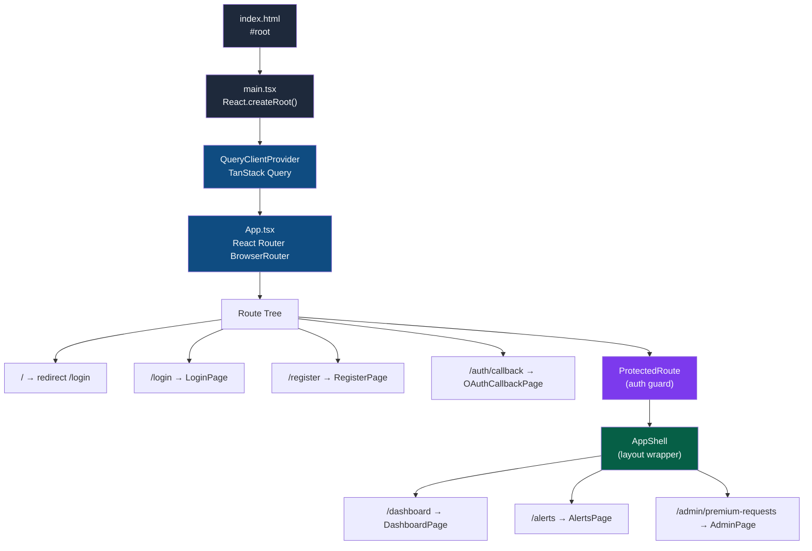

---

## 2. Component Tree

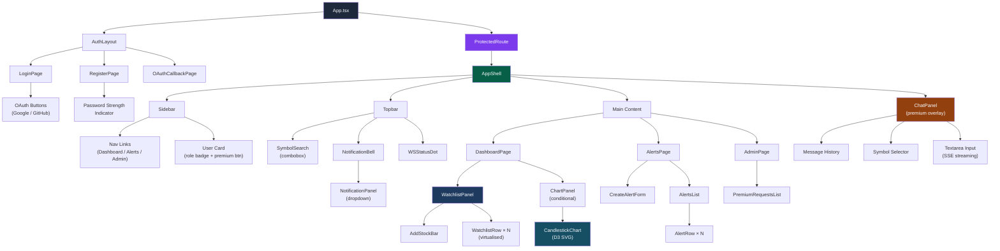

---

## 3. Routing & Authentication Guard

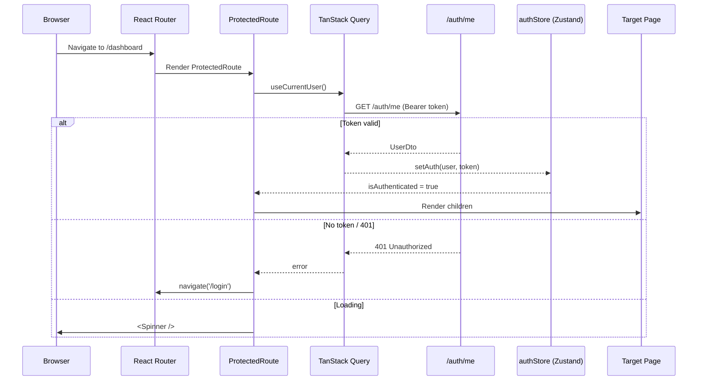

---

## 4. Zustand State Stores

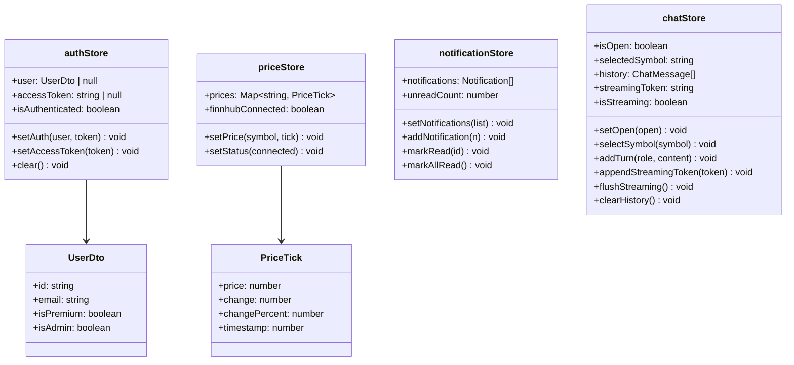

---

## 5. Server State — TanStack Query + Custom Hooks

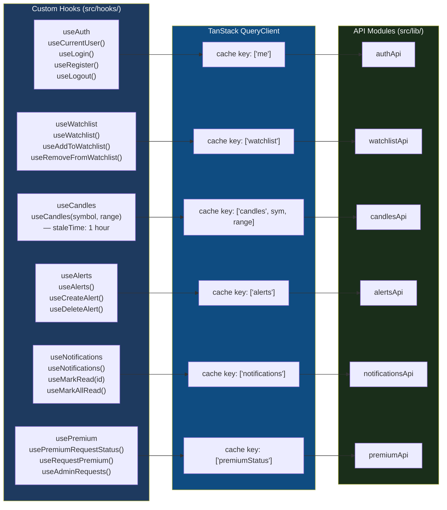

---

## 6. HTTP Client & Token Refresh Flow

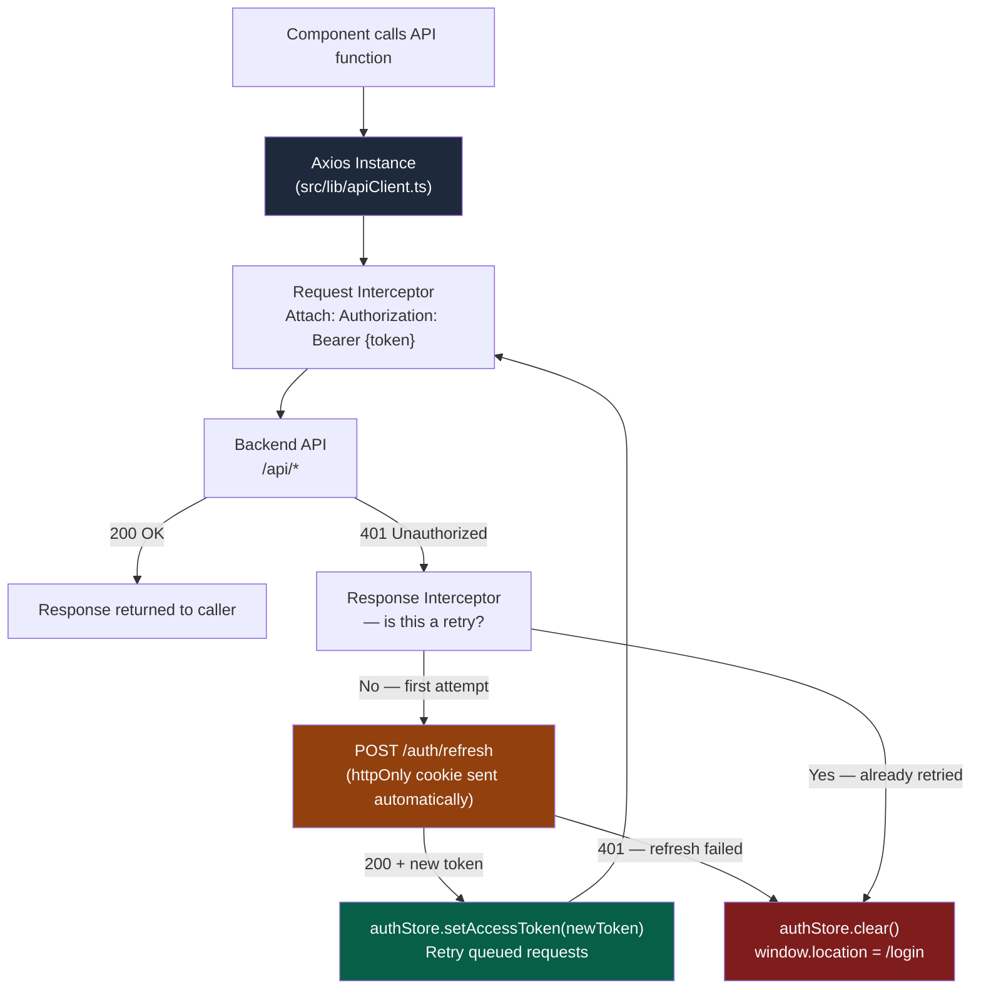

---

## 7. WebSocket Architecture & Real-Time Data Flow

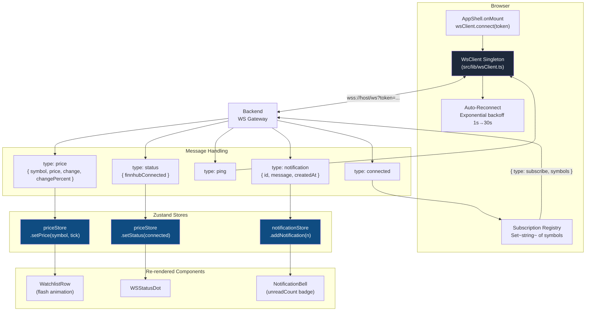

---

## 8. Live Price Update — End-to-End Data Flow

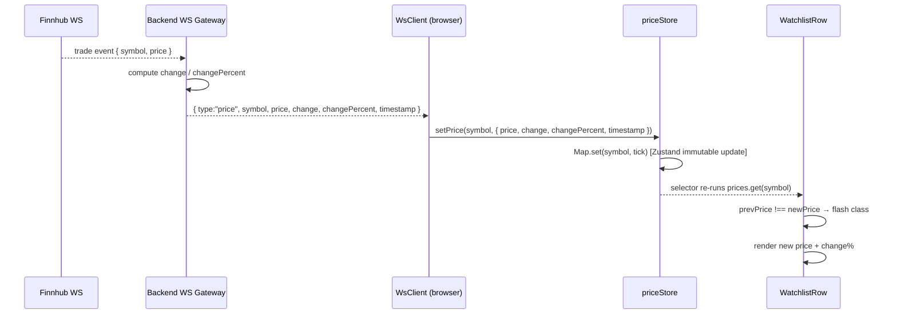

---

## 9. Add Stock to Watchlist — Data Flow

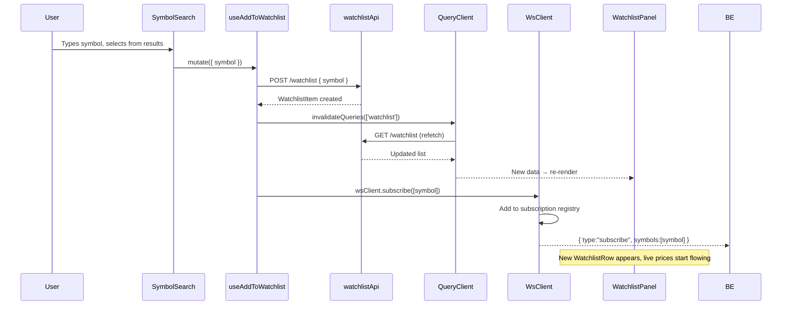

---

## 10. AI Chat (SSE Streaming) — Data Flow

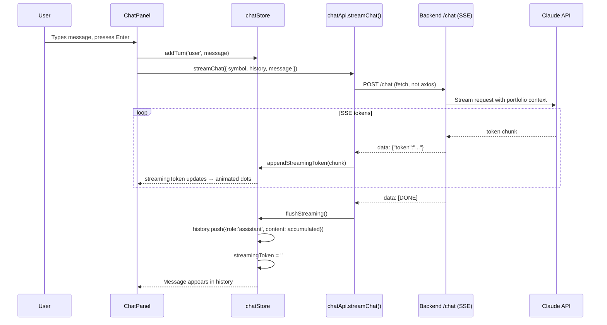

---

## 11. Authentication Flows

```mermaid
flowchart TD
    subgraph Email["Email / Password Flow"]
        direction LR
        L1["LoginPage\n(React Hook Form + Zod)"] --> L2["useLogin() mutation"]
        L2 --> L3["POST /auth/login"]
        L3 -->|"{ user, accessToken }"| L4["authStore.setAuth()"]
        L4 --> L5["navigate('/dashboard')"]
    end

    subgraph OAuth["OAuth Flow"]
        direction LR
        O1["Login/Register Page\nOAuth buttons"] --> O2["Redirect to\n/api/auth/google\nor /api/auth/github"]
        O2 --> O3["Backend OAuth\nhandshake"]
        O3 --> O4["/auth/callback?accessToken=..."]
        O4 --> O5["OAuthCallbackPage\nextract token from URL"]
        O5 --> O6["GET /auth/me\n(token in Authorization header)"]
        O6 --> O7["authStore.setAuth()\nnavigate('/dashboard')"]
    end

    subgraph Logout["Logout Flow"]
        direction LR
        LO1["useLogout() mutation"] --> LO2["POST /auth/logout\n(clears httpOnly cookie)"]
        LO2 --> LO3["authStore.clear()"]
        LO3 --> LO4["queryClient.clear()"]
        LO4 --> LO5["navigate('/login')"]
    end

    style L4 fill:#065f46,color:#f8fafc
    style O7 fill:#065f46,color:#f8fafc
    style LO3 fill:#7f1d1d,color:#f8fafc
```

---

## 12. Candlestick Chart — Rendering Pipeline

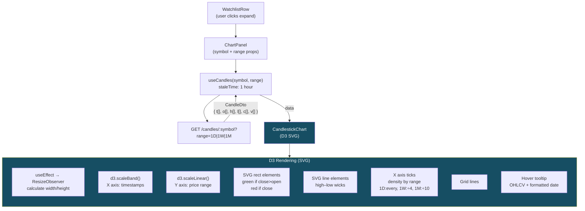

---

## 13. Notification System — Complete Flow

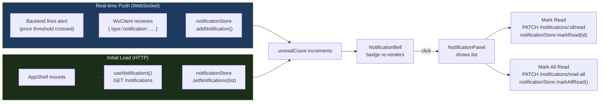

---

## 14. Price Alert Lifecycle

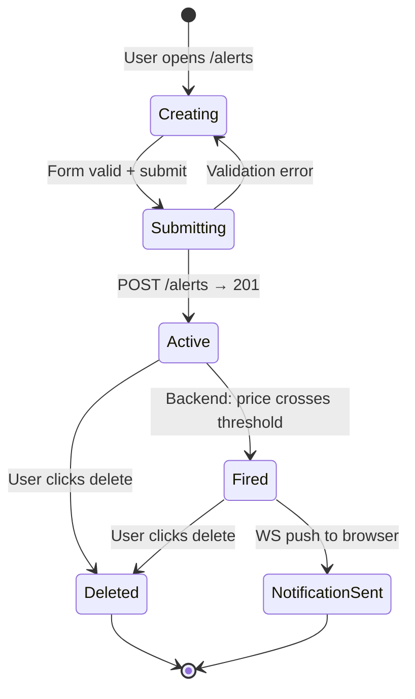

---

## 15. Watchlist Virtualization

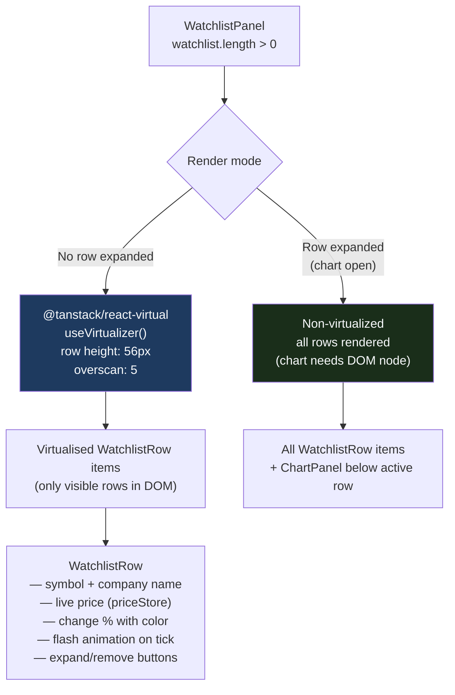

---

## 16. Premium Access Flow

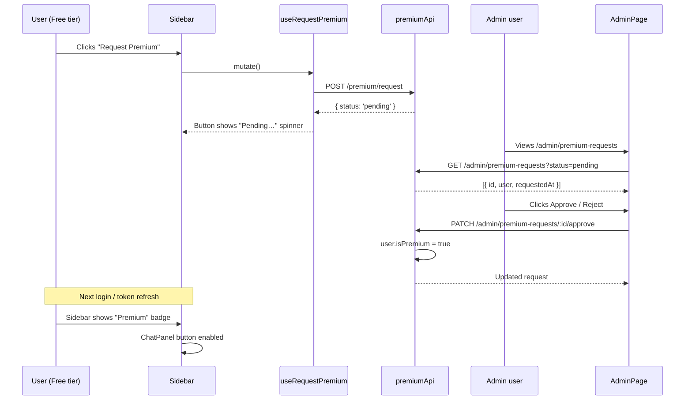

---

## 17. Dependency & Layer Map

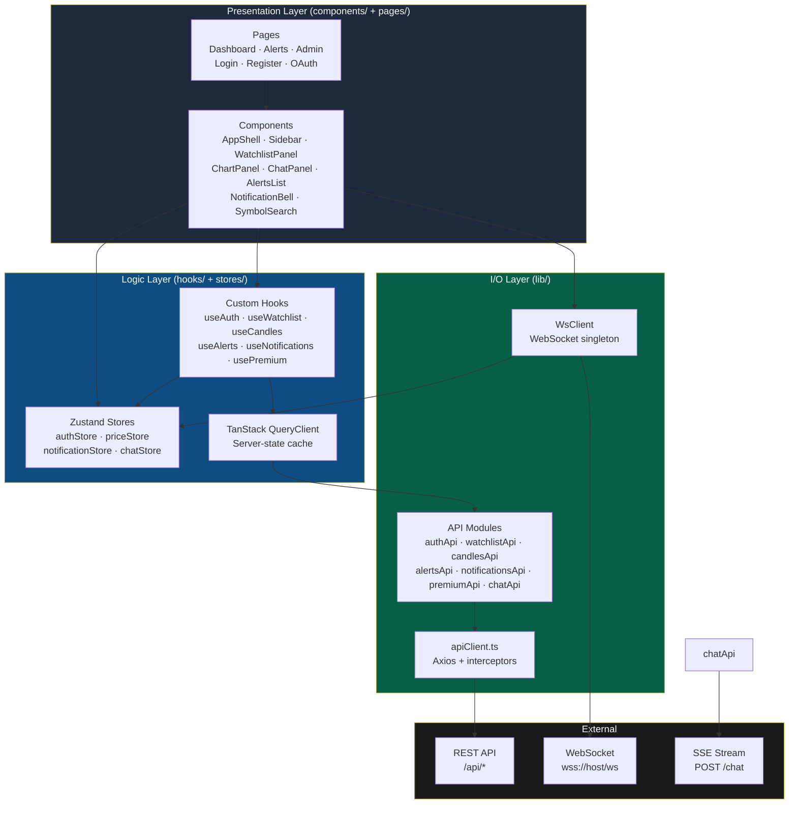

---

## 18. File & Module Map

```
apps/frontend/src/
│
├── main.tsx                    Bootstrap: React root + QueryClientProvider
├── App.tsx                     Router: all route definitions
├── index.css                   Tailwind + custom animations (flash, shimmer)
│
├── pages/
│   ├── LoginPage.tsx           Email/password + OAuth sign-in
│   ├── RegisterPage.tsx        Registration + password strength
│   ├── OAuthCallbackPage.tsx   Handles /auth/callback redirect
│   ├── DashboardPage.tsx       WatchlistPanel + conditional ChartPanel
│   ├── AlertsPage.tsx          CreateAlertForm + AlertsList
│   └── AdminPage.tsx           Premium request approval UI
│
├── components/
│   ├── layout/
│   │   ├── AppShell.tsx        Master layout + WS connect on mount
│   │   ├── Sidebar.tsx         Nav + user card + premium request
│   │   └── AuthLayout.tsx      Branding panel + form panel
│   ├── auth/
│   │   └── ProtectedRoute.tsx  Auth guard → spinner or redirect
│   ├── watchlist/
│   │   ├── WatchlistPanel.tsx  Virtualised list container
│   │   ├── WatchlistRow.tsx    Single row with live price + flash
│   │   └── AddStockBar.tsx     Symbol input form
│   ├── chart/
│   │   ├── ChartPanel.tsx      Range tabs + title + skeleton
│   │   └── CandlestickChart.tsx D3 SVG OHLCV chart
│   ├── chat/
│   │   └── ChatPanel.tsx       SSE streaming AI chat overlay
│   ├── alerts/
│   │   ├── CreateAlertForm.tsx Zod-validated alert form
│   │   ├── AlertsList.tsx      Table container
│   │   └── AlertRow.tsx        Single alert with status badge
│   ├── notifications/
│   │   ├── NotificationBell.tsx Topbar icon + unread badge
│   │   └── NotificationPanel.tsx Dropdown notification list
│   ├── search/
│   │   └── SymbolSearch.tsx    Debounced combobox (300ms)
│   └── WSStatusDot.tsx         Green/red WS connection indicator
│
├── hooks/
│   ├── useAuth.ts              useCurrentUser / useLogin / useRegister / useLogout
│   ├── useWatchlist.ts         useWatchlist / useAdd / useRemove
│   ├── useCandles.ts           useCandles(symbol, range)
│   ├── useAlerts.ts            useAlerts / useCreate / useDelete
│   ├── useNotifications.ts     useNotifications / useMarkRead / useMarkAllRead
│   └── usePremium.ts           useRequestPremium / useAdminRequests / approve / reject
│
├── stores/
│   ├── authStore.ts            JWT + user profile (in-memory)
│   ├── priceStore.ts           Live ticks Map + Finnhub status
│   ├── notificationStore.ts    Notification list + unread count
│   └── chatStore.ts            Chat history + SSE streaming state
│
└── lib/
    ├── apiClient.ts            Axios instance + 401 auto-refresh
    ├── authApi.ts              register / login / me / logout
    ├── watchlistApi.ts         list / add / remove
    ├── candlesApi.ts           fetch(symbol, range)
    ├── alertsApi.ts            list / create / remove
    ├── notificationsApi.ts     list / markRead / markAllRead
    ├── premiumApi.ts           request / status / admin CRUD
    ├── chatApi.ts              streamChat (SSE fetch) / getChatContext
    └── wsClient.ts             WS singleton + auto-reconnect + subscription registry
```

---

## 19. Key Design Decisions

| Decision | Choice | Reason |
|---|---|---|
| Client routing | React Router v7 (plain Routes) | No loader complexity; auth handled in hooks |
| Global UI state | Zustand v5 | Minimal boilerplate; works naturally with WebSocket push |
| Server state | TanStack Query v5 | Cache invalidation, stale-while-revalidate, deduplication |
| Real-time | Native WebSocket singleton | Full duplex; price ticks too frequent for polling |
| AI streaming | Fetch + ReadableStream (SSE) | Axios does not stream; SSE keeps tokens flowing |
| Charts | D3 v7 (SVG) | Full control over candle layout, tooltips, and animation |
| Large lists | @tanstack/react-virtual | Handles 1000+ watchlist items with 56px rows |
| Token storage | Memory (Zustand) + httpOnly refresh cookie | XSS-resistant; silent refresh on 401 |
| CSS | Tailwind v4 | Utility-first; zero dead CSS in production build |
| Build | Vite + React Compiler | Sub-second HMR; auto-memoization via compiler |
