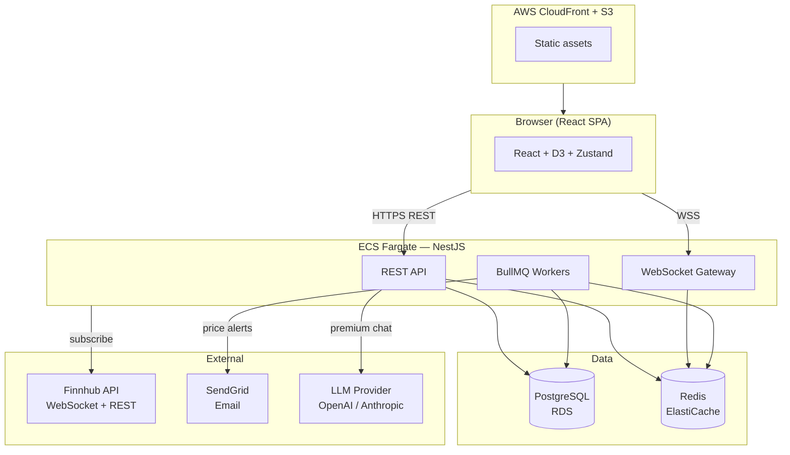
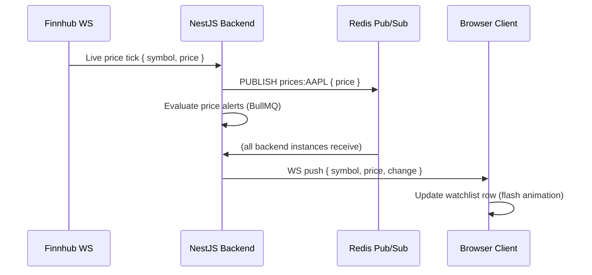
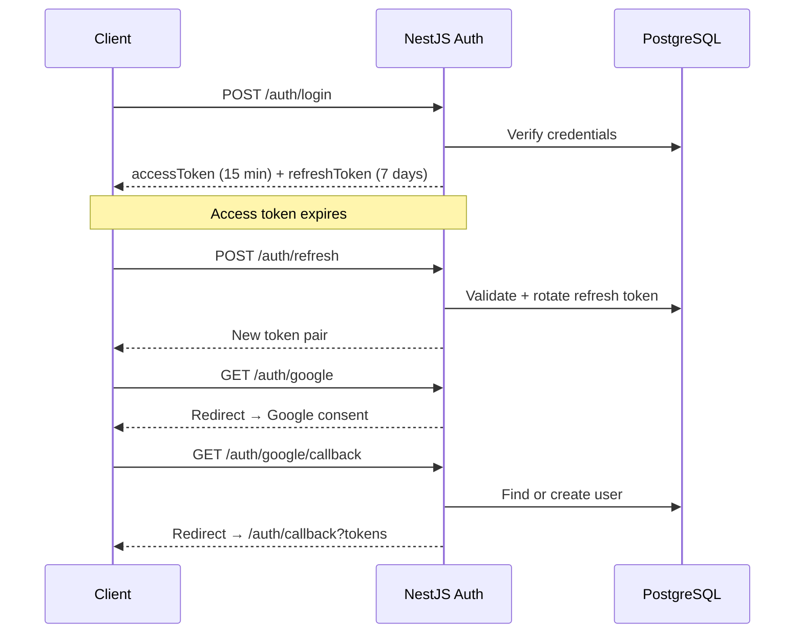
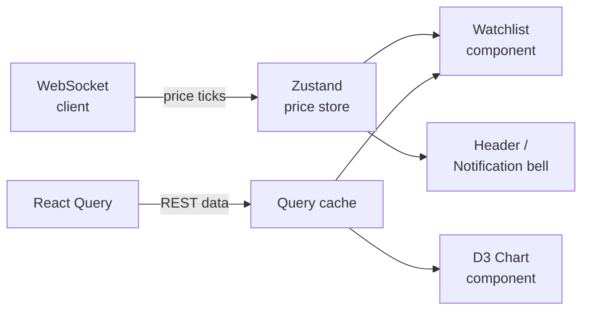

# StockTracker

A full-stack, real-time stock price dashboard. Live WebSocket price feeds, D3 visualisations, price threshold alerts, and an AI portfolio chatbot for premium users.

Built as a portfolio project demonstrating real-time architecture, modern React patterns, type-safe full-stack TypeScript, and production-grade engineering practices.

---

## Live Demo

> Deployment in progress — see [Phase 6](docs/phase1.md) for CI/CD and cloud rollout plan.

---

## Feature Overview

| Feature                                 | Free | Premium |
| --------------------------------------- | ---- | ------- |
| Real-time price feed (WebSocket)        | ✅   | ✅      |
| Unlimited watchlist                     | ✅   | ✅      |
| Historical charts (1D / 1W / 1M)        | ✅   | ✅      |
| Price threshold alerts (email + in-app) | ✅   | ✅      |
| AI portfolio chatbot                    | —    | ✅      |

---

## Tech Stack

### Frontend

|                |                                             |
| -------------- | ------------------------------------------- |
| Framework      | React 18 + TypeScript (strict)              |
| Data fetching  | TanStack Query v5 (React Query)             |
| UI state       | Zustand                                     |
| Visualisations | D3.js                                       |
| Styling        | Tailwind CSS                                |
| Forms          | React Hook Form + Zod                       |
| Real-time      | Native WebSocket client                     |
| Performance    | TanStack Virtual (virtualised lists)        |
| Testing        | Vitest + React Testing Library + Playwright |
| Bundler        | Vite                                        |

### Backend

|               |                                                |
| ------------- | ---------------------------------------------- |
| Runtime       | Node.js + TypeScript (strict)                  |
| Framework     | NestJS                                         |
| Database      | PostgreSQL (via Prisma ORM)                    |
| Cache + queue | Redis (ElastiCache) + BullMQ                   |
| Auth          | JWT (access + refresh rotation) + Passport.js  |
| Social auth   | OAuth 2.0 — Google, GitHub                     |
| Real-time     | NestJS WebSocket Gateway                       |
| Email         | Nodemailer + SendGrid                          |
| LLM           | Provider-agnostic adapter (OpenAI / Anthropic) |
| Testing       | Jest + Supertest                               |

### Infrastructure

|                   |                           |
| ----------------- | ------------------------- |
| Cloud             | AWS                       |
| Frontend hosting  | S3 + CloudFront           |
| Backend compute   | ECS Fargate               |
| Database          | RDS PostgreSQL            |
| Cache             | ElastiCache Redis         |
| Load balancer     | Application Load Balancer |
| IaC               | Terraform                 |
| CI/CD             | GitHub Actions            |
| SAST              | CodeQL + SonarCloud       |
| Secret management | AWS Secrets Manager       |

---

## Architecture

### System Overview



### Real-time Price Flow



### Auth Flow



### Frontend Data Flow



---

## Project Structure

```
stocktracker/
├── apps/
│   ├── frontend/          # React SPA (Vite)
│   │   ├── src/
│   │   │   ├── components/
│   │   │   ├── pages/
│   │   │   ├── hooks/
│   │   │   ├── stores/      # Zustand stores
│   │   │   ├── lib/         # API client, WS client
│   │   │   └── types/
│   │   └── ...
│   └── backend/           # NestJS API
│       ├── src/
│       │   ├── auth/
│       │   ├── users/
│       │   ├── watchlist/
│       │   ├── alerts/
│       │   ├── notifications/
│       │   ├── prices/      # Finnhub WS + gateway
│       │   ├── chat/        # LLM adapter
│       │   └── prisma/
│       └── ...
├── packages/
│   └── types/             # Shared TS types (DTOs)
├── docs/
│   ├── phase1.md
│   ├── mockups/
│   │   ├── login.html
│   │   ├── register.html
│   │   └── dashboard.html
├── infra/                 # Terraform modules
│   ├── modules/
│   │   ├── ecs/
│   │   ├── rds/
│   │   ├── redis/
│   │   ├── alb/
│   │   └── cdn/
│   ├── staging/
│   └── production/
├── REQUIREMENTS.md
├── CLOUD_COST_ANALYSIS.md
└── turbo.json
```

---

## Local Development

### Prerequisites

- Node.js 20+
- Docker (for local services — PostgreSQL, Redis, Mailpit)
- A Finnhub API key (free at [finnhub.io](https://finnhub.io))
- Google + GitHub OAuth app credentials

### Setup

```bash
# 1. Install dependencies
npm install

# 2. Start all local services (PostgreSQL, Redis, Mailpit)
docker compose -f docker-compose.dev.yml up -d

# 3. Copy environment template and fill in values
cp apps/backend/.env.example apps/backend/.env

# 4. Run database migrations
cd apps/backend && npx prisma migrate dev

# 5. Start both frontend and backend
npm run dev
```

Frontend: `http://localhost:5173`  
Backend API: `http://localhost:3001`  
Prisma Studio: `npx prisma studio` → `http://localhost:5555`

### Local Docker Services

| Service    | Purpose                        | Port(s)              |
| ---------- | ------------------------------ | -------------------- |
| PostgreSQL | Primary database               | `5432`               |
| Redis      | Pub/Sub, price cache, BullMQ   | `6379`               |
| Mailpit    | Catches outbound email locally | SMTP `1025`, UI `8025` |

#### Viewing alert emails locally

When a price alert fires during local development, the email is intercepted by **Mailpit** — no real email is sent. Open the Mailpit web UI to inspect it:

```
http://localhost:8025
```

You will see the full email including subject, body, and recipient, rendered exactly as it would appear in a real inbox. The inbox clears on container restart.

To start only Mailpit (if the other services are already running):

```bash
docker compose -f docker-compose.dev.yml up -d mailpit
```

To stop all local services:

```bash
docker compose -f docker-compose.dev.yml down
```

### Environment Variables

See [`apps/backend/.env.example`](apps/backend/.env.example) for all required variables:

```
DATABASE_URL=
JWT_ACCESS_SECRET=
JWT_REFRESH_SECRET=
GOOGLE_CLIENT_ID=
GOOGLE_CLIENT_SECRET=
GITHUB_CLIENT_ID=
GITHUB_CLIENT_SECRET=
FINNHUB_API_KEY=

# BullMQ (defaults to REDIS_URL if not set)
BULLMQ_REDIS_URL=redis://localhost:6379

# Email — Mailpit catches all mail locally (no real emails sent in dev)
SMTP_HOST=localhost
SMTP_PORT=1025
SMTP_USER=
SMTP_PASS=
EMAIL_FROM=noreply@stocktracker.dev

# Phase 5 — AI chatbot (not required until Phase 5)
LLM_PROVIDER=openai          # or: anthropic
LLM_API_KEY=
```

> In production, `SMTP_HOST`/`SMTP_PORT` point to SendGrid (or another SMTP relay) and `BULLMQ_REDIS_URL` points to ElastiCache.

---

## CI/CD Pipeline

Every push triggers the full pipeline via GitHub Actions:

```
Push / PR
  ├── Type check      (tsc --noEmit)
  ├── Lint            (ESLint — zero errors required)
  ├── Format check    (Prettier)
  ├── Unit tests      (Vitest + Jest + coverage)
  ├── SAST scan       (CodeQL)
  ├── Dep audit       (npm audit --audit-level=high)
  ├── Docker build    (frontend + backend images)
  └── E2E tests       (Playwright)

Merge to main
  ├── Push images     → AWS ECR
  ├── Terraform plan
  └── Deploy          → Staging (ECS rolling deploy)

Production         (manual approval gate)
  └── Deploy          → Production (ECS rolling deploy)
```

---

## Delivery Phases

| Phase  | Scope                                                            | Status      |
| ------ | ---------------------------------------------------------------- | ----------- |
| 1      | Monorepo + auth (email/password + OAuth) + dashboard shell       | ✅ Complete |
| 2      | Live data feed + watchlist (Finnhub WebSocket, virtualised list) | ✅ Complete |
| 3      | Historical charts (D3 candlestick, 1D/1W/1M)                     | ✅ Complete |
| 4      | Price alerts + email + in-app notifications + sidebar nav        | ✅ Complete |
| 4b     | Premium upgrade request flow (user request → admin approval)     | Planning    |
| 5      | Premium AI chatbot (LLM adapter, streaming, portfolio context)   | Planning    |
| 6      | CI/CD + Terraform + AWS cloud deploy + WCAG audit                | Pending     |

Detailed plans: [Phase 1](docs/phase1.md) · [Phase 2](docs/phase2.md) · [Phase 3](docs/phase3.md) · [Phase 4](docs/phase4.md) · [Phase 4b](docs/premium-upgrade.md) · [Phase 5](docs/phase5.md)

Operations: [Admin bootstrap & password management](docs/admin-bootstrap.md)

---

## Engineering Standards

- **TypeScript strict mode** — no implicit `any`, full type coverage
- **ESLint** — `typescript-eslint` strict + `eslint-plugin-jsx-a11y` (zero errors in CI)
- **Prettier** — enforced via Husky pre-commit hook
- **Test coverage** — ≥80% on business logic (auth, alert evaluation, LLM adapter)
- **WCAG 2.1 AA** — keyboard navigation, ARIA labels, contrast ratios, screen reader support
- **SAST** — CodeQL + SonarCloud on every PR
- **Dependency scanning** — Dependabot + `npm audit` on every push
- **No secrets in code** — AWS Secrets Manager in production; `.env` gitignored locally

---

## Documentation

- [Requirements](REQUIREMENTS.md) — full product requirements
- [Cloud cost analysis](CLOUD_COST_ANALYSIS.md) — AWS vs Azure vs PaaS breakdown
- [Phase 1 plan](docs/phase1.md) — detailed milestones, arch diagrams, MVP definition
- [UI Mockups](docs/mockups/) — interactive HTML mockups (open in browser)
