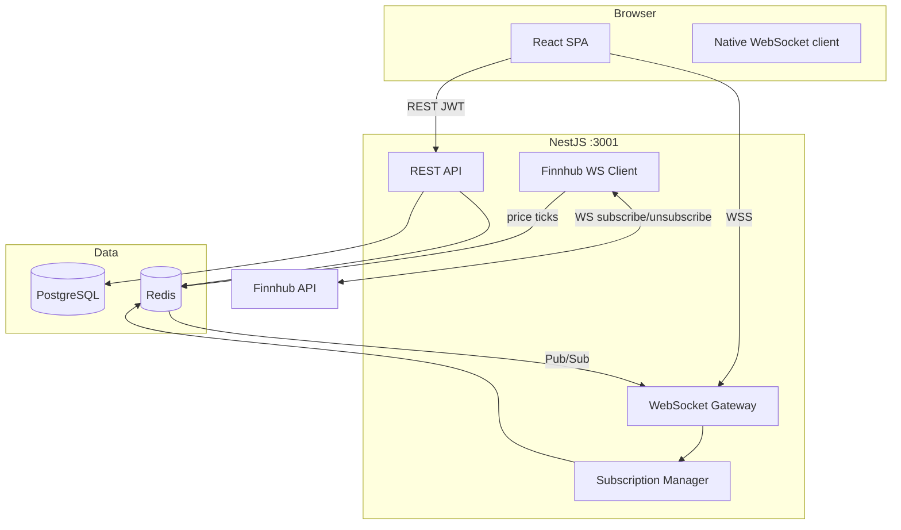
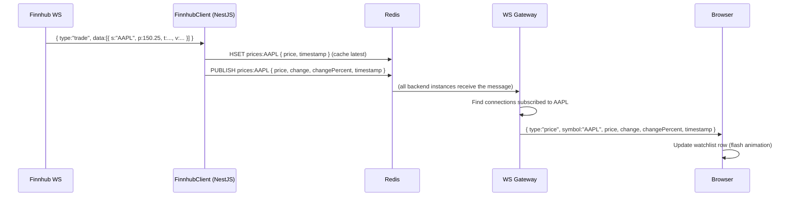
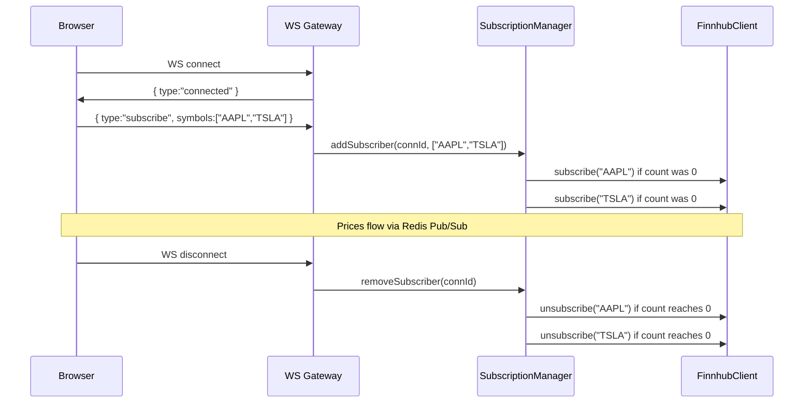
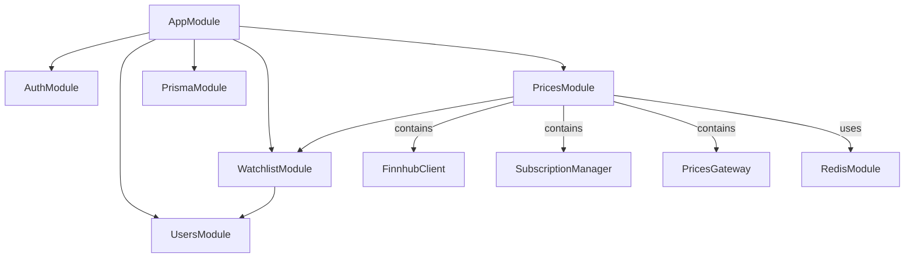
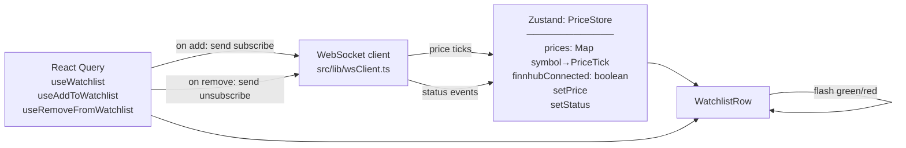
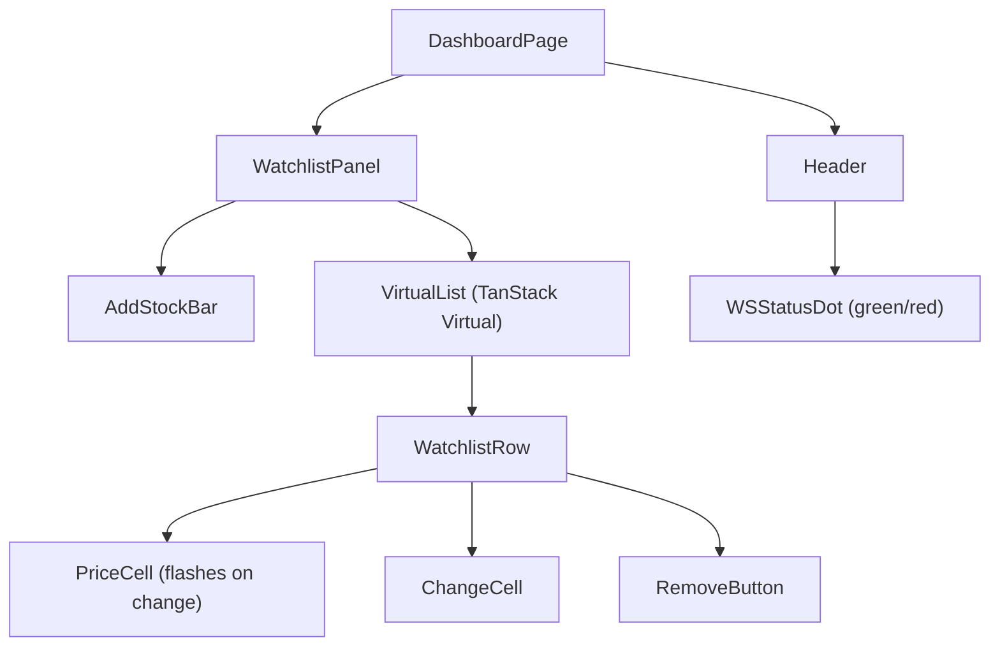

# Phase 2 — Live Data + Watchlist

**Status:** Complete  
**Goal:** A user can manage a watchlist of stock symbols and see real-time prices updating live via WebSocket, backed by a Finnhub upstream feed and Redis Pub/Sub.

---

## Accepted MVP (Definition of Done)

Phase 2 is complete when **all** of the following scenarios pass end-to-end in the local dev environment:

| # | Scenario | Expected Result | Status |
|---|---|---|---|
| M1 | `POST /watchlist` with `{ symbol: "AAPL" }` (authenticated) | `201` + watchlist item | ✅ |
| M2 | `POST /watchlist` with duplicate symbol for same user | `409 Conflict` | ✅ |
| M3 | `GET /watchlist` (authenticated) | `200` + array of watchlist items | ✅ |
| M4 | `DELETE /watchlist/:id` (authenticated) | `200` — item removed | ✅ |
| M5 | `DELETE /watchlist/:id` for another user's item | `403 Forbidden` | ✅ |
| M6 | Any watchlist endpoint without auth | `401 Unauthorized` | ✅ |
| M7 | Browser opens WebSocket to `ws://localhost:3001` | Connection accepted, server sends `{ type: "connected" }` | ✅ |
| M8 | User adds AAPL to watchlist; Finnhub sends a price tick | Browser receives `{ type: "price", … }` within seconds | ✅ |
| M9 | User removes AAPL from watchlist (last subscriber) | Backend unsubscribes from Finnhub; client stops receiving ticks | ✅ |
| M10 | Second browser tab opens WebSocket | Both tabs receive the same price ticks; Finnhub subscribed once | ✅ |
| M11 | Finnhub WebSocket drops | Backend reconnects automatically with exponential backoff; status events broadcast | ✅ |
| M12 | Dashboard renders watchlist with live price rows | Prices update in place; row flashes green/red on change | ✅ |
| M13 | Watchlist with 50+ items | List virtualised — no layout jank, smooth scroll | ✅ |
| M14 | `GET /watchlist` returns items with last known price from Redis | New symbol seeded via Finnhub `/quote` on add; note staleness — see [TD-001](tech-debt.md#td-001) | ✅ ⚠️ |
| M15 | ESLint + Prettier + `tsc --noEmit` all pass with zero errors | CI green — 27 backend tests, 21 frontend tests passing | ✅ |

---

## 1. Architecture Overview

### System Context (Phase 2 additions)



### Real-time Price Flow



### WebSocket Connection Lifecycle



---

## 2. Backend

### Module Structure (additions in bold)



### Prisma Schema Addition

```prisma
model WatchlistItem {
  id      String   @id @default(cuid())
  symbol  String
  userId  String
  user    User     @relation(fields: [userId], references: [id], onDelete: Cascade)
  addedAt DateTime @default(now())

  @@unique([userId, symbol])
}
```

Add `watchlistItems WatchlistItem[]` to the `User` model.  
Requires a new migration: `prisma migrate dev --name add-watchlist`.

### REST API Endpoints

| Method | Path | Guard | Description |
|---|---|---|---|
| `GET` | `/watchlist` | JWT | List authenticated user's watchlist items |
| `POST` | `/watchlist` | JWT | Add a symbol to the watchlist |
| `DELETE` | `/watchlist/:id` | JWT | Remove a watchlist item (owner check) |

### WebSocket Message Protocol

**Client → Server:**

```typescript
// Subscribe to price updates for a list of symbols
{ type: "subscribe", symbols: string[] }

// Unsubscribe (e.g. when user removes from watchlist)
{ type: "unsubscribe", symbols: string[] }

// Heartbeat reply
{ type: "pong" }
```

**Server → Client:**

```typescript
// Sent on connection established
{ type: "connected" }

// Live price tick
{ type: "price", symbol: string, price: number, change: number, changePercent: number, timestamp: number }

// Finnhub connection status
{ type: "status", finnhubConnected: boolean }

// Keepalive from server
{ type: "ping" }
```

### FinnhubClient Design

- Singleton NestJS service (`OnModuleInit`, `OnModuleDestroy`)
- Maintains **one** WebSocket connection to `wss://ws.finnhub.io?token=<API_KEY>`
- On message: parses trade ticks, computes `change` from last known price (stored in Redis), publishes to Redis channel `prices:<SYMBOL>`
- On close: exponential backoff reconnect (1s → 2s → 4s → 8s, max 30s)
- Exposes `subscribe(symbol)` and `unsubscribe(symbol)` — sends Finnhub's wire format:
  ```json
  { "type": "subscribe", "symbol": "AAPL" }
  ```

### SubscriptionManager Design

- Tracks a `Map<symbol, Set<connectionId>>` in memory (per-instance)
- `addSubscriber(connId, symbols[])`:
  - Add connId to each symbol's set
  - Call `finnhubClient.subscribe(symbol)` only when set size goes 0 → 1
- `removeSubscriber(connId)`:
  - Remove connId from all symbol sets
  - Call `finnhubClient.unsubscribe(symbol)` when set size goes 1 → 0
- `getSubscribersForSymbol(symbol)`: returns Set of connIds currently watching

### Redis Usage

| Key pattern | Type | Purpose |
|---|---|---|
| `prices:<SYMBOL>` | Hash (`price`, `change`, `changePercent`, `timestamp`) | Latest known price — served to new WS connections immediately |
| `channel prices:<SYMBOL>` | Pub/Sub channel | Fan-out price ticks to all Gateway instances |

Two separate Redis clients needed: one for publishing (and hash writes), one for subscribing (a subscribing client cannot issue other commands).

### Backend Milestones & TODOs

**M1 — Redis + Docker**
- [ ] Add Redis service to `docker-compose.dev.yml`
- [ ] Add `REDIS_URL` to `.env` and `.env.example`
- [ ] Install `ioredis`, create `RedisModule` (provides publisher + subscriber clients)

**M2 — Watchlist CRUD**
- [ ] Add `WatchlistItem` model to Prisma schema
- [ ] Run `prisma migrate dev --name add-watchlist`
- [ ] Create `WatchlistModule`, `WatchlistService`, `WatchlistController`
- [ ] Implement `GET /watchlist`, `POST /watchlist`, `DELETE /watchlist/:id`
- [ ] Ownership guard on DELETE (403 if item belongs to another user)
- [ ] Write unit tests: WatchlistService (add, remove, duplicate, not-found)

**M3 — Finnhub WebSocket Client**
- [ ] Install `ws` + `@types/ws`
- [ ] Implement `FinnhubClient` service (connect, reconnect, subscribe, unsubscribe)
- [ ] On trade tick: update Redis hash, compute change from previous price, publish to Redis channel
- [ ] Broadcast `{ type: "status", finnhubConnected }` on connect/disconnect via Redis
- [ ] Add `FINNHUB_API_KEY` to `.env` and `.env.example`

**M4 — WebSocket Gateway**
- [ ] Install `@nestjs/platform-ws` (raw WS, not Socket.io — required for frontend native WebSocket)
- [ ] Implement `PricesGateway` (`@WebSocketGateway`)
- [ ] Handle `subscribe` / `unsubscribe` messages from client
- [ ] Subscribe to Redis channel for each symbol a connection is watching
- [ ] On connect: send `{ type: "connected" }`, start ping interval
- [ ] On disconnect: call `SubscriptionManager.removeSubscriber`
- [ ] Serve cached price from Redis immediately on subscribe (no waiting for next tick)

**M5 — Auth for WebSocket**
- [ ] Validate JWT on WebSocket connection (via query param `?token=<accessToken>`)
- [ ] Reject connection with close code `4001` if token is invalid or missing
- [ ] Store `userId` on the connection for subscription scoping

---

## 3. Frontend

### State Architecture (additions)



### Component Tree (additions)



### Frontend Milestones & TODOs

**M1 — API layer**
- [ ] Add watchlist types to `packages/types` (`WatchlistItem`, `AddToWatchlistDto`)
- [ ] Create `watchlistApi.ts` — `list()`, `add(symbol)`, `remove(id)`
- [ ] Create `useWatchlist`, `useAddToWatchlist`, `useRemoveFromWatchlist` hooks (React Query)

**M2 — WebSocket client**
- [ ] Implement `wsClient.ts` — singleton, connects with JWT token in query param
- [ ] Auto-reconnect on close (with backoff)
- [ ] Subscribe to symbols when connection opens (replay pending subscriptions)
- [ ] Dispatch incoming messages to Zustand `PriceStore`

**M3 — Price store**
- [ ] Implement `PriceStore` (Zustand): `prices`, `finnhubConnected`, `setPrice`, `setStatus`
- [ ] Write unit tests: price updates, status toggle

**M4 — Watchlist UI**
- [ ] Install `@tanstack/react-virtual`
- [ ] Build `WatchlistRow`: symbol, company name placeholder, price, change%, remove button
- [ ] Flash animation: green on price up, red on price down (CSS transition, 800ms)
- [ ] Build `AddStockBar`: input + add button, validates symbol format (1–5 uppercase letters)
- [ ] Build `WatchlistPanel` with TanStack Virtual for the list
- [ ] Empty state (already exists from Phase 1 — now wire it to real data)

**M5 — Status indicator**
- [ ] Add `WSStatusDot` to header: green dot = connected, red dot + "Reconnecting…" = offline
- [ ] Write component tests: renders correct state for connected/disconnected

---

## 4. Infrastructure

### Docker Compose (updated)

```yaml
services:
  postgres:
    # ... (unchanged from Phase 1)

  redis:
    image: redis:7-alpine
    ports:
      - '6379:6379'
    command: redis-server --appendonly yes
    volumes:
      - redis_data:/data
    healthcheck:
      test: ['CMD', 'redis-cli', 'ping']
      interval: 5s
      timeout: 3s
      retries: 5

volumes:
  postgres_data:
  redis_data:
```

### New Environment Variables

```
REDIS_URL=redis://localhost:6379
FINNHUB_API_KEY=<from finnhub.io — free tier>
```

### Finnhub Free Tier Constraints

| Constraint | How we handle it |
|---|---|
| 1 WebSocket connection per API key | Single `FinnhubClient` singleton; all symbols share one connection |
| 60 API calls/minute (REST) | REST only used for historical data in Phase 3 — not needed here |
| ~50 simultaneous symbol subscriptions | `SubscriptionManager` logs a warning above 40 symbols; acceptable for demo |

### Local Dev Start Sequence

```bash
# 1. Start Postgres + Redis
docker compose -f docker-compose.dev.yml up -d

# 2. Start frontend + backend
npm run dev

# 3. Open Prisma Studio (optional)
cd apps/backend && npx prisma studio
```

### Phase 1 Smoke Test (do before writing any Phase 2 code)

Verify the Phase 1 auth stack works end-to-end before building on top of it:

```bash
BASE=http://localhost:3001

# Register
curl -sc /tmp/st-cookies.txt -X POST $BASE/auth/register \
  -H 'Content-Type: application/json' \
  -d '{"email":"test@example.com","password":"password123"}' | jq .

# Login
curl -sc /tmp/st-cookies.txt -X POST $BASE/auth/login \
  -H 'Content-Type: application/json' \
  -d '{"email":"test@example.com","password":"password123"}' | jq .

# Save access token
TOKEN=$(curl -sb /tmp/st-cookies.txt -X POST $BASE/auth/login \
  -H 'Content-Type: application/json' \
  -d '{"email":"test@example.com","password":"password123"}' | jq -r .accessToken)

# Get current user
curl -sb /tmp/st-cookies.txt $BASE/auth/me \
  -H "Authorization: Bearer $TOKEN" | jq .

# Refresh (uses httpOnly cookie)
curl -sb /tmp/st-cookies.txt -X POST $BASE/auth/refresh | jq .

# Logout
curl -sb /tmp/st-cookies.txt -X POST $BASE/auth/logout | jq .
```

Expected: each step returns the documented shape. If anything is broken, fix it before Phase 2 code starts.

---

## 5. Shared Types (additions)

```typescript
// packages/types/src/index.ts additions

export interface WatchlistItemDto {
  id: string
  symbol: string
  addedAt: string
  // Populated from Redis cache — may be null if no tick received yet
  latestPrice: PriceTick | null
}

export interface AddToWatchlistDto {
  symbol: string
}

// WebSocket message union (server → client)
export type WsServerMessage =
  | { type: 'connected' }
  | { type: 'price'; symbol: string; price: number; change: number; changePercent: number; timestamp: number }
  | { type: 'status'; finnhubConnected: boolean }
  | { type: 'ping' }

// WebSocket message union (client → server)
export type WsClientMessage =
  | { type: 'subscribe'; symbols: string[] }
  | { type: 'unsubscribe'; symbols: string[] }
  | { type: 'pong' }
```

---

## 6. Out of Scope for Phase 2

- Historical OHLCV candle data / D3 charts (Phase 3)
- Price threshold alerts / BullMQ workers (Phase 4)
- Email notifications (Phase 4)
- AI chatbot (Phase 5)
- Company name / logo resolution (nice-to-have, deferred)
- Stock search / symbol autocomplete (deferred — user types symbol directly for now)
