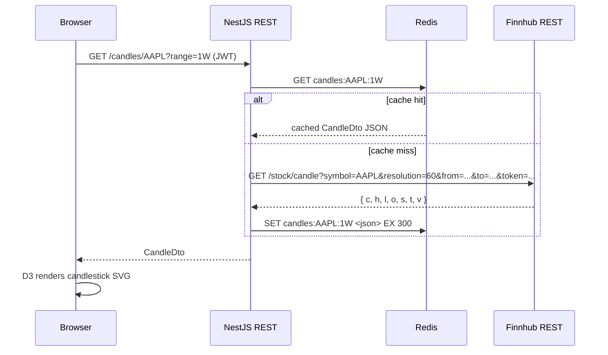
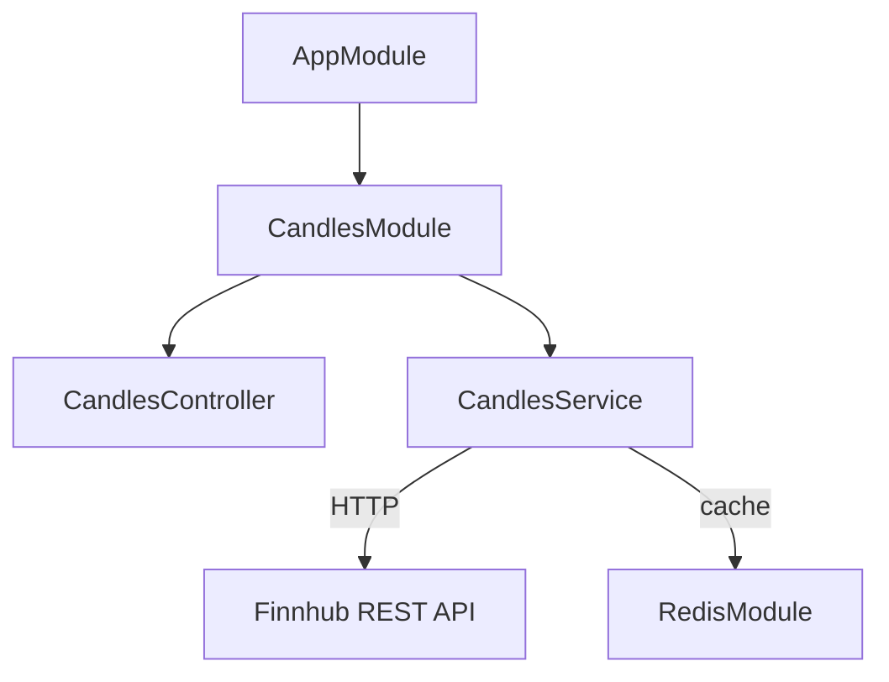
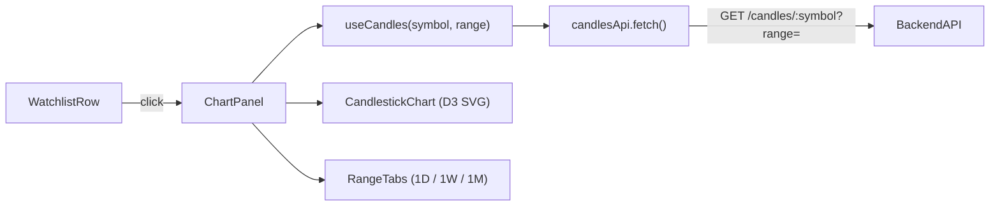
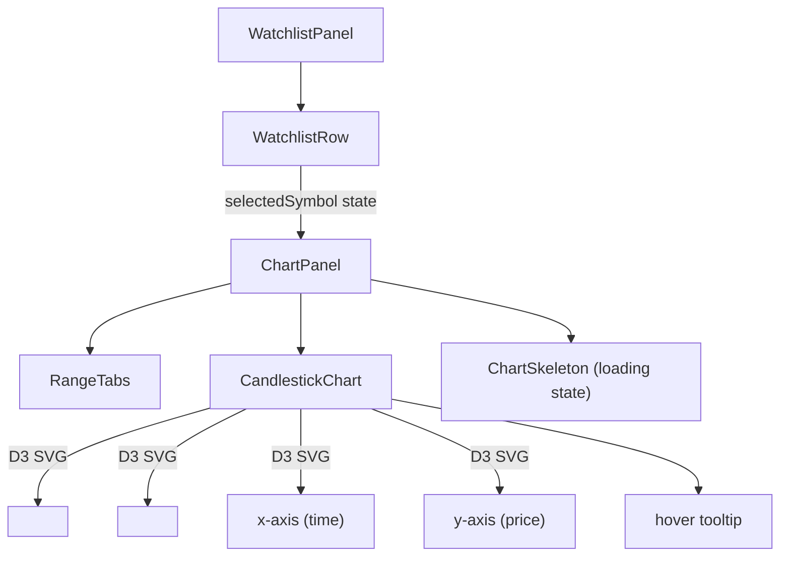

# Phase 3 — Historical Charts

**Status:** Planning  
**Goal:** A user can click a stock in the watchlist to open a D3 candlestick chart with 1D / 1W / 1M time-range switching, backed by the Finnhub historical candle REST API and Redis caching.

---

## Accepted MVP (Definition of Done)

Phase 3 is complete when **all** of the following scenarios pass end-to-end in the local dev environment:

| # | Scenario | Expected Result |
|---|---|---|
| C1 | `GET /candles/AAPL?range=1D` (authenticated) | `200` + OHLCV array, ~78 5-min candles for today's trading session |
| C2 | `GET /candles/AAPL?range=1W` | `200` + daily candles for the last 7 calendar days |
| C3 | `GET /candles/AAPL?range=1M` | `200` + daily candles for the last 30 calendar days |
| C4 | `GET /candles/AAPL?range=1D` called twice within 60 s | Second call returns Redis-cached data — no outbound Finnhub HTTP request |
| C5 | `GET /candles/AAPL?range=1D` without auth header | `401 Unauthorized` |
| C6 | `GET /candles/INVALID?range=1D` | `400 Bad Request` (symbol fails `[A-Z]{1,5}` validation) |
| C7 | User clicks a watchlist row | `ChartPanel` slides open below the row showing the candlestick chart |
| C8 | User toggles 1D / 1W / 1M | Chart re-renders with correct candles and axis labels; loading skeleton shown during fetch |
| C9 | Chart with 200 candles | No layout jank, smooth render; interaction (hover tooltip) works correctly |
| C10 | Chart accessibility | `role="img"` with descriptive `aria-label`; range buttons have `aria-pressed`; keyboard-navigable |
| C11 | ESLint + Prettier + `tsc --noEmit` all pass | CI green |

---

## 1. Architecture Overview

### Data Flow



### Range → Finnhub Resolution Mapping

| UI Range | Finnhub resolution | `from` (relative to now) | Redis TTL |
|---|---|---|---|
| `1D` | `5` (5-min bars) | Today 09:30 AM ET | 60 s |
| `1W` | `60` (1-hr bars) | 7 calendar days ago | 5 min |
| `1M` | `D` (daily bars) | 30 calendar days ago | 15 min |

> **Free tier note**: Finnhub REST is 60 calls/min. Redis caching ensures repeated range
> switches don't hit the rate limit. The `1D` TTL is short so intraday data stays fresh.

---

## 2. Backend

### New Module: `CandlesModule`



### Files to Create

```
apps/backend/src/candles/
  candles.module.ts
  candles.controller.ts
  candles.service.ts
  dto/
    candles-query.dto.ts
```

### `CandlesController` — `GET /candles/:symbol`

```typescript
@Controller('candles')
@UseGuards(JwtAuthGuard)
export class CandlesController {
  @Get(':symbol')
  getCandles(
    @Param('symbol') symbol: string,
    @Query() query: CandlesQueryDto,
  ): Promise<CandleDto>
}
```

### `CandlesQueryDto`

```typescript
export class CandlesQueryDto {
  @IsIn(['1D', '1W', '1M'])
  range: ChartRange
}
```

Symbol validation — `@Matches(/^[A-Z]{1,5}$/)` on the `@Param`.

### `CandlesService` Logic

```typescript
async getCandles(symbol: string, range: ChartRange): Promise<CandleDto> {
  const cacheKey = `candles:${symbol}:${range}`
  const cached = await this.redis.get(cacheKey)
  if (cached) return JSON.parse(cached) as CandleDto

  const { resolution, from, to } = resolveRange(range)
  const data = await this.fetchFinnhub(symbol, resolution, from, to)

  const ttl = range === '1D' ? 60 : range === '1W' ? 300 : 900
  await this.redis.set(cacheKey, JSON.stringify(data), 'EX', ttl)
  return data
}
```

`resolveRange()` calculates unix timestamps from the current time, accounting for the US/Eastern
market-open offset for 1D.

### Backend Milestones & TODOs

**B1 — Module scaffold**
- [ ] Create `CandlesModule`, register in `AppModule`
- [ ] Install `axios` for server-side HTTP (already in frontend, add to backend `package.json`)

**B2 — Finnhub REST integration**
- [ ] Implement `fetchFinnhub(symbol, resolution, from, to)` using axios
- [ ] Map `ChartRange` → `{ resolution, from, to }` in `resolveRange()`
- [ ] Handle `s === 'no_data'` response from Finnhub (return empty `CandleDto`)

**B3 — Redis caching**
- [ ] Read from `REDIS_PUB` using `GET candles:<symbol>:<range>`
- [ ] Write with per-range TTL (60 / 300 / 900 s)

**B4 — Validation & error handling**
- [ ] `@Matches(/^[A-Z]{1,5}$/)` on symbol param → 400
- [ ] `@IsIn(['1D','1W','1M'])` on range query → 400
- [ ] Finnhub HTTP errors → 502 Bad Gateway

**B5 — Tests**
- [ ] `CandlesService` unit tests: cache hit, cache miss → Finnhub call, `no_data` path
- [ ] `CandlesController` e2e smoke: `200` with mock service, `400` on bad symbol/range, `401` without JWT

---

## 3. Frontend

### State & Data Flow



### Component Tree (additions)



### `CandlestickChart` D3 Design

- SVG with responsive width via `ResizeObserver`
- X-axis: `d3.scaleTime()`, tick count adapts to range (hourly for 1D, daily for 1W/1M)
- Y-axis: `d3.scaleLinear()` — domain padded ±2% beyond high/low
- Candle body: `<rect>` — green (`#22c55e`) if close ≥ open, red (`#ef4444`) otherwise
- Wick: `<line>` connecting low → high
- Hover tooltip: follows mouse, shows OHLCV values + formatted timestamp
- `role="img"` `aria-label="Candlestick chart for {symbol}, {range}"` on `<svg>`

### `ChartPanel` Interaction

- Opens when user clicks a `WatchlistRow`; closes on second click or when another row is clicked
- Defaults to `1D` range on first open
- Preserves selected range per symbol (stored in component state, not persisted)
- Shows `ChartSkeleton` (pulsing gray bars) during loading
- Shows "No data available" message when Finnhub returns `s === 'no_data'`

### Frontend Milestones & TODOs

**F1 — Dependencies**
- [ ] `npm install d3 @types/d3` in `apps/frontend`

**F2 — API layer**
- [ ] Add `CandleDto`, `ChartRange` to `packages/types/src/index.ts`
- [ ] Create `apps/frontend/src/lib/candlesApi.ts` — `fetch(symbol, range): Promise<CandleDto>`

**F3 — React Query hook**
- [ ] Create `apps/frontend/src/hooks/useCandles.ts`
- [ ] `staleTime`: 1D → 60 s, 1W → 5 min, 1M → 15 min (mirrors backend TTL)

**F4 — CandlestickChart component**
- [ ] Create `apps/frontend/src/components/chart/CandlestickChart.tsx`
- [ ] Responsive width via `ResizeObserver`
- [ ] Candle bodies + wicks via D3 data-join
- [ ] Hover tooltip
- [ ] ARIA attributes

**F5 — ChartPanel + RangeTabs**
- [ ] Create `apps/frontend/src/components/chart/ChartPanel.tsx`
- [ ] `1D / 1W / 1M` tab buttons with `aria-pressed`
- [ ] Loading skeleton + no-data state
- [ ] Animate open/close with CSS transition

**F6 — Wire into WatchlistRow / WatchlistPanel**
- [ ] `WatchlistRow` accepts `isExpanded` + `onToggle` props
- [ ] `WatchlistPanel` tracks `expandedSymbol: string | null`
- [ ] `ChartPanel` rendered below the selected row in the virtual list

**F7 — Tests**
- [ ] `useCandles.test.ts` — returns data, handles loading state, stale time correct
- [ ] `CandlestickChart.test.tsx` — renders SVG, correct number of candle rects, ARIA label
- [ ] `ChartPanel.test.tsx` — range tab click triggers new query, shows skeleton while loading

---

## 4. Infrastructure

### New Dependencies

**Backend:**
```
axios   (server-side HTTP to Finnhub REST)
```

**Frontend:**
```
d3          ^7.x
@types/d3   ^7.x
```

### New Environment Variables

None — `FINNHUB_API_KEY` already set in Phase 2.

### Redis Cache Keys (Phase 3 additions)

| Key pattern | Type | TTL | Purpose |
|---|---|---|---|
| `candles:<SYMBOL>:<RANGE>` | String (JSON) | 60–900 s | Cached `CandleDto` response |

---

## 5. Shared Types (additions to `packages/types/src/index.ts`)

```typescript
// ─── Chart / Candle DTOs ──────────────────────────────────────────────────────

/** Mirrors Finnhub /stock/candle response shape */
export interface CandleDto {
  c: number[]           // close prices
  h: number[]           // high prices
  l: number[]           // low prices
  o: number[]           // open prices
  s: 'ok' | 'no_data'  // status
  t: number[]           // unix timestamps (seconds)
  v: number[]           // volumes
}

export type ChartRange = '1D' | '1W' | '1M'
```

---

## 6. Mock Data

A `candleMocks.ts` file in `apps/frontend/src/mocks/` provides deterministic OHLCV fixtures
for all three ranges for AAPL and TSLA. Used in:

- Component tests (no network calls)
- `CandlesService` unit tests (mocked return value)
- Storybook stories (if added in Phase 6)

Key properties of the mock data:
- Seeded pseudo-random walk — deterministic across runs
- Realistic price range: AAPL ~$185–$190, TSLA ~$235–$250
- Correct candle count per range: 78 (1D/5-min), 42 (1W/1-hr), 22 (1M/daily)
- `s: 'ok'` for all fixtures; a separate `MOCK_CANDLES_NO_DATA` exported for the no-data path

---

## 7. Out of Scope for Phase 3

- Volume bars on chart (deferred to polish pass)
- Line chart mode toggle (deferred)
- Company fundamentals / P/E overlay (deferred)
- Price alerts triggered from chart (Phase 4)
- Chart export / screenshot (out of scope v1)
