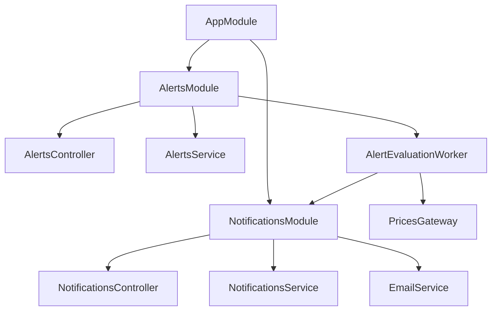
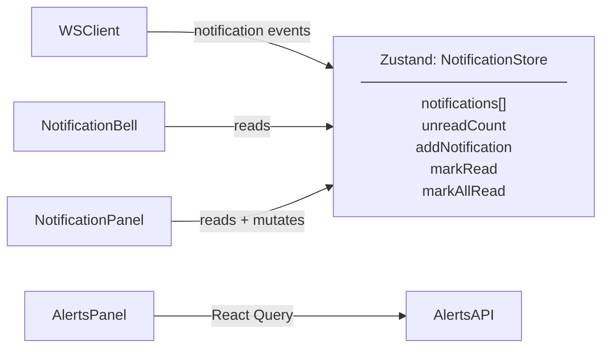
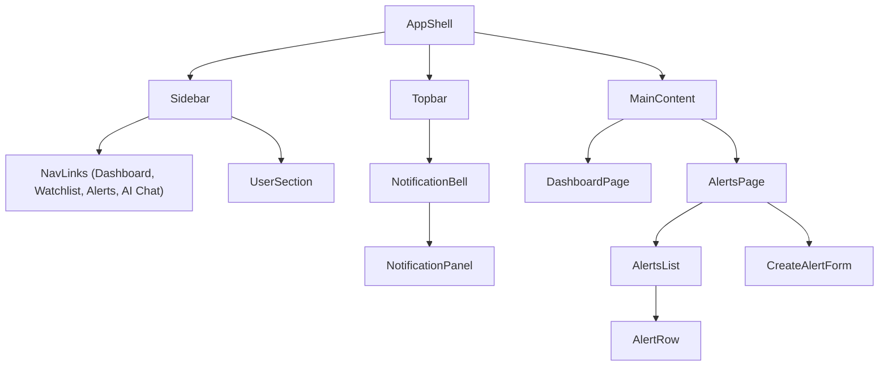

# Phase 4 — Alerts & Notifications

**Status:** Planning  
**Goal:** Users can set upper/lower price threshold alerts on any watchlist symbol. When a threshold is crossed, they receive an in-app notification (WebSocket push + notification panel) and an email. Phase 4 also introduces the sidebar navigation and full watchlist row polish, converging the running UI toward the design mockups.

---

## Accepted MVP (Definition of Done)

Phase 4 is complete when **all** of the following scenarios pass end-to-end in the local dev environment:

| # | Scenario | Expected Result |
|---|---|---|
| A1 | `POST /alerts` with `{ symbol, threshold, direction }` (authenticated) | `201` + alert object |
| A2 | `GET /alerts` (authenticated) | `200` + array of user's alerts |
| A3 | `DELETE /alerts/:id` (authenticated, owner) | `200` — alert removed |
| A4 | `DELETE /alerts/:id` for another user's alert | `403 Forbidden` |
| A5 | Live price tick crosses an active upper threshold | BullMQ worker fires; notification created in DB; user receives `{ type: "notification", … }` WS push within 5 s |
| A6 | Live price tick crosses an active lower threshold | Same as A5 |
| A7 | Alert fires once and does not re-fire on same tick | Alert marked `firedAt`; subsequent ticks at same price ignored |
| A8 | `GET /notifications` (authenticated) | `200` + array, unread first |
| A9 | `PATCH /notifications/:id/read` | `200`; notification marked read |
| A10 | `PATCH /notifications/read-all` | `200`; all user notifications marked read |
| A11 | Email sent to user when alert fires | Email delivered to dev inbox (Mailpit / MailHog) |
| A12 | Notification bell badge shows unread count | Badge increments on new WS notification, clears on "mark all read" |
| A13 | Notification panel opens / closes from topbar bell | Dropdown lists recent notifications with timestamp and mark-read actions |
| A14 | Sidebar renders with Dashboard, Watchlist, Alerts, AI Chat (disabled) links | Active link highlighted; Alerts badge shows count; AI Chat shows "Premium" badge |
| A15 | Watchlist rows show Symbol, Company name, Price, Change, Change% columns with headers | Columns align; company name shows placeholder if lookup not available |
| A16 | ESLint + Prettier + `tsc --noEmit` all pass | CI green |

---

## 1. Architecture Overview

### Alert Evaluation Flow

```mermaid
sequenceDiagram
    participant FH as Finnhub WS
    participant FC as FinnhubClient
    participant R as Redis Pub/Sub
    participant GW as PricesGateway
    participant BQ as BullMQ Worker
    participant DB as PostgreSQL
    participant EM as Email (Nodemailer)
    participant BR as Browser

    FH->>FC: trade tick { s: "AAPL", p: 196.00 }
    FC->>R: PUBLISH prices:AAPL
    R->>GW: fan-out to browser clients
    R->>BQ: AlertEvaluationJob { symbol, price }
    BQ->>DB: load active alerts for AAPL
    DB-->>BQ: [{ id, userId, threshold: 195, direction: "above" }]
    BQ->>BQ: 196.00 > 195 → fires
    BQ->>DB: create Notification; mark alert firedAt
    BQ->>GW: emit notification to userId's WS connection
    GW->>BR: { type: "notification", … }
    BQ->>EM: send threshold-crossed email
```

### Module Structure (additions)



---

## 2. Backend

### Prisma Schema Additions

```prisma
model PriceAlert {
  id        String    @id @default(cuid())
  userId    String
  user      User      @relation(fields: [userId], references: [id], onDelete: Cascade)
  symbol    String
  threshold Float
  direction AlertDirection
  isActive  Boolean   @default(true)
  firedAt   DateTime?
  createdAt DateTime  @default(now())
}

model Notification {
  id        String   @id @default(cuid())
  userId    String
  user      User     @relation(fields: [userId], references: [id], onDelete: Cascade)
  alertId   String?
  message   String
  isRead    Boolean  @default(false)
  createdAt DateTime @default(now())
}

enum AlertDirection {
  above
  below
}
```

Migration: `prisma migrate dev --name add-alerts-notifications`

### New REST Endpoints

| Method | Path | Guard | Description |
|---|---|---|---|
| `GET` | `/alerts` | JWT | List user's alerts |
| `POST` | `/alerts` | JWT | Create alert |
| `DELETE` | `/alerts/:id` | JWT | Delete alert (owner check) |
| `GET` | `/notifications` | JWT | List user's notifications |
| `PATCH` | `/notifications/:id/read` | JWT | Mark one read |
| `PATCH` | `/notifications/read-all` | JWT | Mark all read |

### BullMQ Alert Evaluation Worker

- Queue: `alert-evaluation`
- Job published by `FinnhubClient.processTick()` on every price tick: `{ symbol, price }`
- Worker loads all `isActive: true` alerts for the symbol
- Evaluates each: `direction === 'above' ? price >= threshold : price <= threshold`
- On match: creates `Notification`, sets `alert.firedAt`, dispatches WS push via `PricesGateway`, sends email
- Idempotent: re-queued ticks for already-fired alerts are no-ops

### Email Service

- Dev: **Mailpit** (Docker, catches all outbound mail locally — no real emails sent)
- Transport: Nodemailer with SMTP config from env
- Template: plain-text + minimal HTML — "Your alert for AAPL crossed $195.00"
- New env vars: `SMTP_HOST`, `SMTP_PORT`, `SMTP_USER`, `SMTP_PASS`, `EMAIL_FROM`

### Backend Milestones & TODOs

**B1 — Schema + Migration**
- [ ] Add `PriceAlert`, `Notification` models + `AlertDirection` enum
- [ ] Run `prisma migrate dev --name add-alerts-notifications`
- [ ] Add `alerts` + `notifications` relations to `User` model

**B2 — AlertsModule**
- [ ] `CreateAlertDto`: `symbol` (`@Matches /^[A-Z]{1,5}$/`), `threshold` (`@IsNumber`), `direction` (`@IsIn(['above','below'])`)
- [ ] `AlertsService`: `list`, `create`, `remove` (with ownership check)
- [ ] `AlertsController`: wire endpoints, `JwtAuthGuard`
- [ ] Unit tests: create, remove, 403 on wrong owner

**B3 — BullMQ Worker**
- [ ] Install `bullmq`, `@nestjs/bullmq`, `ioredis` (already installed)
- [ ] Register `BullModule.forRoot` in `AppModule` (reuse `REDIS_PUB` connection string)
- [ ] `AlertEvaluationWorker`: load alerts, evaluate, create notifications, emit WS push
- [ ] Modify `FinnhubClient.processTick()` to enqueue `alert-evaluation` job after Redis publish
- [ ] Unit tests: threshold crossed → notification created, already-fired alert → no-op

**B4 — NotificationsModule**
- [ ] `NotificationsService`: `list`, `markRead`, `markAllRead`
- [ ] `NotificationsController`: wire endpoints
- [ ] Unit tests: list, mark read

**B5 — EmailService**
- [ ] Install `nodemailer`, `@types/nodemailer`
- [ ] `EmailService`: `sendAlertFired(to, symbol, threshold, direction)`
- [ ] Add Mailpit service to `docker-compose.dev.yml`
- [ ] Add SMTP env vars to `.env.example`
- [ ] Unit test: `sendAlertFired` calls `transporter.sendMail` with correct args

**B6 — WS Notification Push**
- [ ] Add `{ type: "notification", id, message, createdAt }` to `WsServerMessage` union in `packages/types`
- [ ] `PricesGateway`: expose `sendToUser(userId, payload)` method
- [ ] `AlertEvaluationWorker` calls `pricesGateway.sendToUser` after notification created

---

## 3. Frontend — Alerts & Notifications

### State Architecture (additions)



### Component Tree (additions)



### Frontend Milestones & TODOs

**F1 — Alerts API + hooks**
- [ ] Add alert types to `packages/types`: `PriceAlert`, `CreateAlertDto`, `AlertDirection`
- [ ] Create `alertsApi.ts`: `list`, `create`, `remove`
- [ ] Create `useAlerts`, `useCreateAlert`, `useDeleteAlert` hooks (React Query)

**F2 — Notifications store + WS wiring**
- [ ] Create `notificationStore.ts` (Zustand): `notifications`, `unreadCount`, `addNotification`, `markRead`, `markAllRead`
- [ ] Wire `wsClient.ts` to dispatch `notification` WS messages to store
- [ ] `useNotifications`, `useMarkRead`, `useMarkAllRead` hooks

**F3 — Alerts page**
- [ ] Create `/alerts` route in `App.tsx`
- [ ] `AlertsPage`: header + `CreateAlertForm` + `AlertsList`
- [ ] `CreateAlertForm`: symbol input, threshold input, above/below toggle, submit
- [ ] `AlertRow`: symbol, threshold, direction, status (active/fired), delete button
- [ ] Empty state: "No alerts set. Add one above."

---

## 4. UI Convergence — Phase 4 Items (UI-P4)

These items close the gap between the running UI and the design mockups. Each is justified by the Phase 4 feature that makes it meaningful.

### UI-P4-1 — Sidebar Navigation

**Justified by:** Alerts adds a second real page; navigation between sections becomes necessary.

**What to build:**
- `Sidebar` component: dark slate-900 background, `w-56`, fixed height
- Logo mark (candlestick SVG icon + "StockTracker" wordmark) at top
- Nav links: Dashboard (active), Watchlist, Alerts, AI Chat (disabled + "Premium" badge — Phase 5 will activate)
- User section at bottom: avatar initial from email, email truncated, "Free plan" / "Premium" label
- `AppShell` layout component wraps `Sidebar` + topbar + main content
- Topbar simplified: remove wordmark (now in sidebar), keep WSStatusDot, bell, search placeholder

**Visual spec:** matches `docs/mockups/dashboard.html` sidebar exactly — slate-900 bg, active link slate-800, hover bg-slate-800, green brand for logo icon.

### UI-P4-2 — Watchlist Row Polish

**Justified by:** Alerts page introduces column-aligned tables; the watchlist should match that visual language.

**What to build:**
- Column headers row: Symbol / Company / Price / Change / Change% (matches mockup)
- `WatchlistRow`: add company name column (static lookup map for top 20 symbols; `—` fallback for unknown)
- Price and change cells right-aligned with `tabular-nums`
- Row height standardised to match mockup density (slightly tighter than current)

### UI-P4-3 — Notification Bell + Panel

**Justified by:** Alerts generate real notifications; the bell dropdown needs to be functional.

**What to build:**
- Bell button shows unread count badge (red, hidden when 0)
- `NotificationPanel` dropdown: list of recent notifications, timestamp, "Mark all read" button
- Unread notifications have subtle green-tinted background
- Empty state: "No notifications yet"
- Animate open/close with CSS transition (matches mockup `hidden-panel` pattern)

### UI-P4 Milestones & TODOs

**UI-P4-1 — Sidebar + AppShell**
- [ ] Create `Sidebar.tsx` component
- [ ] Create `AppShell.tsx` layout (sidebar + topbar + `<Outlet />`)
- [ ] Update `App.tsx` routing to wrap protected routes in `AppShell`
- [ ] Update `DashboardPage` to remove its own header (now in AppShell topbar)
- [ ] Smoke test: sidebar nav active state, keyboard nav through links

**UI-P4-2 — Watchlist Row Polish**
- [ ] Add `COMPANY_NAMES` static map (top 20 symbols) to `WatchlistRow`
- [ ] Add column headers row to `WatchlistPanel`
- [ ] Update `WatchlistRow` layout: symbol (w-20), company (flex-1), price (w-28 right), change (w-20 right), change% (w-20 right, hidden on mobile), remove button (w-8)

**UI-P4-3 — Notification Bell + Panel**
- [ ] Create `NotificationPanel.tsx`
- [ ] Wire badge to `notificationStore.unreadCount`
- [ ] Animate open/close
- [ ] Component tests: renders notifications, badge count, mark-all-read

---

## 5. Infrastructure

### Docker Compose Additions

```yaml
mailpit:
  image: axllent/mailpit:latest
  ports:
    - '1025:1025'  # SMTP
    - '8025:8025'  # Web UI (view caught emails)
```

Access caught emails at `http://localhost:8025`.

### New Environment Variables

```
SMTP_HOST=localhost
SMTP_PORT=1025
SMTP_USER=
SMTP_PASS=
EMAIL_FROM=noreply@stocktracker.dev
BULLMQ_REDIS_URL=redis://localhost:6379
```

---

## 6. Shared Types (additions to `packages/types/src/index.ts`)

```typescript
// Already present — AlertDirection, PriceAlert, CreateAlertDto, Notification

// WS message additions
export type WsServerMessage =
  | … // existing
  | { type: 'notification'; id: string; message: string; createdAt: string }
```

---

## 7. Out of Scope for Phase 4

- SMS / push notifications (out of scope v1)
- Alert snooze / recurrence (deferred)
- Alert history / audit log (deferred)
- Email unsubscribe link (Phase 6)
- Stock symbol autocomplete on alert form (deferred — user types symbol directly)
