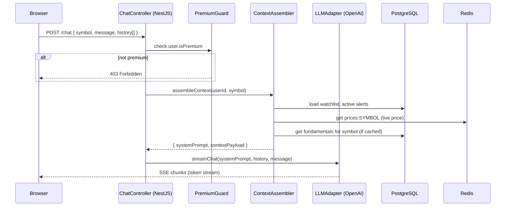
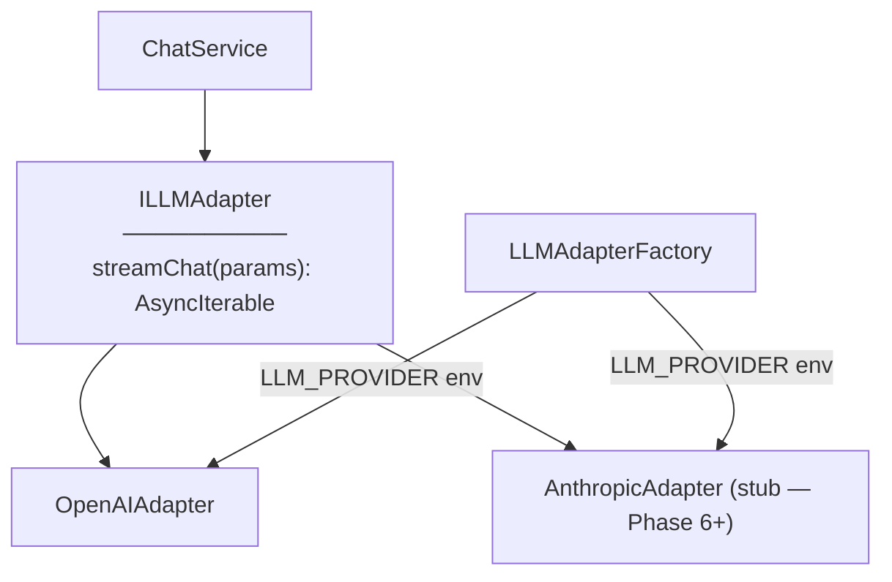
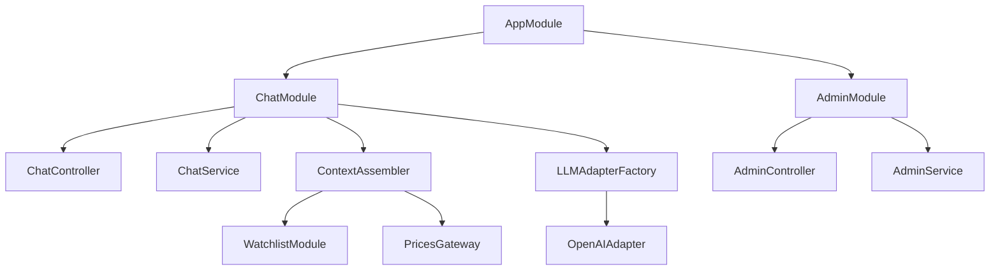
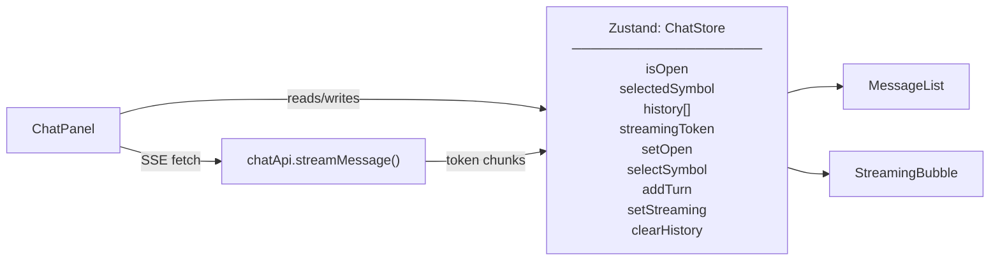
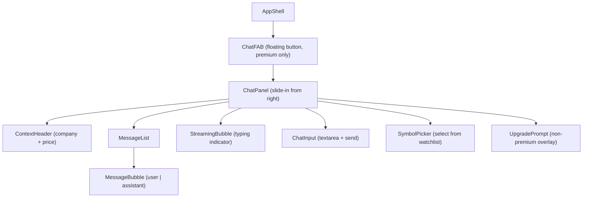

# Phase 5 — Premium AI Chatbot

**Status:** Planning  
**Goal:** Premium users can open a slide-in chat panel on any page and have a context-aware conversation with an AI assistant grounded in their watchlist data, live prices, and company fundamentals. The LLM provider is abstracted behind an adapter interface so it can be swapped without code changes. Phase 5 also completes the remaining UI convergence items: a live symbol search bar in the topbar, a user avatar showing the email initial, and a meaningful "Premium" lock badge on the AI Chat sidebar link.

---

## Accepted MVP (Definition of Done)

Phase 5 is complete when **all** of the following scenarios pass end-to-end in the local dev environment:

| # | Scenario | Expected Result |
|---|---|---|
| P1 | `POST /chat` (free user) | `403 Forbidden` |
| P2 | `POST /chat` (premium user, valid payload) | `200` + streamed text response (SSE or chunked transfer) |
| P3 | `GET /chat/context/:symbol` (premium user) | `200` + assembled context object with watchlist snapshot, live price, fundamentals |
| P4 | Message contains off-topic content (e.g. "write me a poem") | Assistant politely declines and redirects to financial topics |
| P5 | LLM provider env var changed from `openai` to a stub adapter | No code changes required; stub adapter used transparently |
| P6 | Premium user opens chat panel, selects AAPL | Context shown in panel header: company name, ticker, current price |
| P7 | User sends a message; streaming response visible | Tokens appear progressively as they arrive — no wait-then-dump |
| P8 | Conversation continues for 5+ turns | History maintained in session; each turn includes prior exchanges |
| P9 | User closes and reopens panel | Conversation history cleared (session scope, not persisted) |
| P10 | Non-premium user views AI Chat link in sidebar | Link is disabled + "Premium" badge shown; clicking shows upgrade prompt |
| P11 | Admin toggles user to premium via `PATCH /admin/users/:id/premium` | User's subsequent `POST /chat` returns `200` |
| P12 | Topbar search bar finds symbol NVDA | Dropdown lists NVDA with company name; selecting it adds to watchlist or navigates to chart |
| P13 | User avatar in sidebar shows email initial | Avatar renders the first character of user's email, capitalised |
| P14 | ESLint + Prettier + `tsc --noEmit` all pass | CI green |

---

## 1. Architecture Overview

### Chat Request Flow



### LLM Adapter Architecture



### Module Structure (additions)



---

## 2. Backend

### Prisma Schema Additions

```prisma
// No new tables — conversation history is session-only (not persisted).
// isPremium and isAdmin fields added to User:

model User {
  // ... existing fields ...
  isPremium Boolean @default(false)
  isAdmin   Boolean @default(false)
}
```

Migration: `prisma migrate dev --name add-premium-admin-flags`

> **Note:** If `isPremium` / `isAdmin` columns already exist from Phase 1 schema, skip migration.

### New REST Endpoints

| Method | Path | Guard | Description |
|---|---|---|---|
| `POST` | `/chat` | JWT + PremiumGuard | Stream chat response (SSE) |
| `GET` | `/chat/context/:symbol` | JWT + PremiumGuard | Return assembled context object |
| `PATCH` | `/admin/users/:id/premium` | JWT + AdminGuard | Toggle premium status |
| `GET` | `/admin/users` | JWT + AdminGuard | List all users with premium/admin flags |

### PremiumGuard + AdminGuard

```typescript
@Injectable()
export class PremiumGuard implements CanActivate {
  canActivate(ctx: ExecutionContext): boolean {
    const user = ctx.switchToHttp().getRequest().user
    if (!user?.isPremium) throw new ForbiddenException('Premium required')
    return true
  }
}

@Injectable()
export class AdminGuard implements CanActivate {
  canActivate(ctx: ExecutionContext): boolean {
    const user = ctx.switchToHttp().getRequest().user
    if (!user?.isAdmin) throw new ForbiddenException('Admin only')
    return true
  }
}
```

### ILLMAdapter Interface

```typescript
export interface ChatMessage {
  role: 'system' | 'user' | 'assistant'
  content: string
}

export interface ILLMAdapter {
  streamChat(messages: ChatMessage[]): AsyncIterable<string>
}
```

### ContextAssembler

Builds the system prompt from live data:

```typescript
async assembleContext(userId: string, symbol: string): Promise<string> {
  const [watchlist, alerts, price, fundamentals] = await Promise.all([
    this.watchlistService.list(userId),
    this.alertsService.list(userId),      // active alerts for context
    this.redis.hgetall(`prices:${symbol}`),
    this.getFundamentals(symbol),          // Finnhub /stock/profile2 (cached 24h)
  ])

  return buildSystemPrompt({ watchlist, alerts, price, fundamentals, symbol })
}
```

System prompt template (abbreviated):
```
You are a financial research assistant for StockTracker. You help users understand
their portfolio and research companies. Stay strictly on financial topics.

User's watchlist: AAPL ($192.50, +1.2%), TSLA ($248.10, -0.4%), ...
Focus company: Apple Inc. (AAPL) — Current price: $192.50, Mkt cap: $2.9T, ...
Active alerts: AAPL above $200 (active), AAPL below $180 (active)

If asked about anything outside financial/investment topics, politely decline.
```

### Prompt Injection Mitigation

- User message appended as a separate `user` role message — never interpolated into the system prompt string
- System prompt is constructed entirely server-side; client sends only `{ symbol, message, history[] }`
- `history[]` entries validated: each must have `role: 'user' | 'assistant'`, `content: string` (max 4000 chars/message, max 20 turns)
- Symbol validated: `@Matches(/^[A-Z]{1,5}$/)` — prevents injection via symbol field

### Streaming Response (SSE)

```typescript
@Post()
@UseGuards(JwtAuthGuard, PremiumGuard)
@Header('Content-Type', 'text/event-stream')
@Header('Cache-Control', 'no-cache')
async streamChat(
  @Body() dto: ChatDto,
  @Req() req: Request,
  @Res() res: Response,
): Promise<void> {
  const systemPrompt = await this.contextAssembler.assembleContext(req.user.id, dto.symbol)
  const messages = buildMessages(systemPrompt, dto.history, dto.message)

  for await (const chunk of this.llmAdapter.streamChat(messages)) {
    res.write(`data: ${JSON.stringify({ token: chunk })}\n\n`)
  }
  res.write('data: [DONE]\n\n')
  res.end()
}
```

### Backend Milestones & TODOs

**B1 — Schema + Guards**
- [ ] Add `isPremium`, `isAdmin` to `User` model (or verify already present)
- [ ] Run migration if needed
- [ ] Implement `PremiumGuard` and `AdminGuard`
- [ ] Unit tests: PremiumGuard allows premium user, blocks free user; AdminGuard blocks non-admin

**B2 — LLM Adapter**
- [ ] Define `ILLMAdapter` interface + `ChatMessage` type in `packages/types`
- [ ] Implement `OpenAIAdapter`: wraps `openai` SDK streaming (`stream: true`)
- [ ] Implement `StubLLMAdapter` for tests: echoes input deterministically, no API call
- [ ] `LLMAdapterFactory`: selects adapter from `LLM_PROVIDER` env var (`openai` | `stub`)
- [ ] Unit tests: `OpenAIAdapter` calls `openai.chat.completions.create` with correct messages

**B3 — ContextAssembler**
- [ ] `ContextAssembler` service: loads watchlist, alerts, Redis price, Finnhub `/stock/profile2`
- [ ] Cache fundamentals in Redis for 24 h (`fundamentals:<SYMBOL>`)
- [ ] `buildSystemPrompt()` pure function — easy to unit test without NestJS
- [ ] Unit tests: system prompt contains symbol name, watchlist tickers, active alerts

**B4 — ChatModule + Controller**
- [ ] `ChatDto`: `symbol` (`@Matches`), `message` (`@MaxLength(4000)`), `history` (array, max 20 items)
- [ ] `ChatController`: streaming SSE endpoint, `GET /chat/context/:symbol`
- [ ] Prompt injection: history items validated (role enum, content length)
- [ ] Unit tests: off-topic guard integration (system prompt instructs refusal — verify prompt contains refusal instruction)

**B5 — AdminModule**
- [ ] `AdminController`: `PATCH /admin/users/:id/premium`, `GET /admin/users`
- [ ] `AdminService`: `setPremium(userId, isPremium)` — updates `User.isPremium`
- [ ] Unit tests: toggle premium, non-admin blocked

---

## 3. Frontend — Chat Panel

### State Architecture (additions)



### Component Tree (additions)



### Frontend Milestones & TODOs

**F1 — Chat types + API**
- [ ] Add `ChatMessage`, `ChatDto`, `ChatContextDto` to `packages/types`
- [ ] Create `chatApi.ts`: `streamMessage(dto): EventSource`-style async generator that reads SSE chunks
- [ ] Create `getContext(symbol): Promise<ChatContextDto>`

**F2 — Chat store**
- [ ] Create `chatStore.ts` (Zustand): `isOpen`, `selectedSymbol`, `history`, `streamingToken`
- [ ] `addTurn(role, content)`, `setStreaming(token)`, `clearHistory()`
- [ ] Unit tests: add turn, streaming state, clear

**F3 — Chat panel UI**
- [ ] `ChatPanel.tsx`: slide-in from right, `w-96`, `fixed right-0`, CSS transition open/close
- [ ] `SymbolPicker`: dropdown from user's watchlist (populated via `useWatchlist`)
- [ ] `ContextHeader`: shows company name + current price from `chatStore.selectedSymbol`
- [ ] `MessageBubble`: user messages right-aligned (slate-700 bg), assistant left-aligned (slate-800 bg)
- [ ] `StreamingBubble`: animated dots while streaming, replaced by full message on `[DONE]`
- [ ] `ChatInput`: textarea (Enter to send, Shift+Enter for newline), disabled while streaming
- [ ] `UpgradePrompt`: shown when `user.isPremium === false` — "Upgrade to Premium to unlock AI Chat"
- [ ] `ChatFAB`: floating action button, bottom-right, hidden for non-premium users

**F4 — Streaming integration**
- [ ] Connect `chatApi.streamMessage()` to store: each chunk appended to `streamingToken`, on `[DONE]` call `addTurn('assistant', fullResponse)`
- [ ] Abort controller on panel close mid-stream

**F5 — Symbol search (topbar)**
- [ ] `SymbolSearch.tsx` in topbar: debounced input, `GET /search?q=NVDA` (Finnhub `/search` endpoint)
- [ ] Dropdown shows up to 8 results with symbol + company name
- [ ] Selecting a result: adds to watchlist (calls `useAddToWatchlist`) or navigates to chart if already in watchlist

---

## 4. UI Convergence — Phase 5 Items (UI-P5)

These items close the remaining gap between the running UI and the design mockups. Each is justified by the Phase 5 feature that makes it meaningful.

### UI-P5-1 — Topbar Symbol Search

**Justified by:** AI Chat panel requires symbol selection; a search bar in the topbar is the natural UX for picking a company to chat about, and also improves the add-stock flow (FR-WATCH-01 calls for symbol + company name search).

**What to build:**
- Search bar in the topbar (`flex-1`, centered between logo and bell)
- Placeholder: "Search stocks…"
- Debounced (300 ms) call to backend `/search?q=` → Finnhub `/search` proxy endpoint
- Dropdown: up to 8 results, symbol bold + company name muted, keyboard navigable
- Select: if symbol not in watchlist → confirm add; if already in watchlist → open chart panel for that symbol
- Visual spec: matches `docs/mockups/dashboard.html` topbar search exactly

### UI-P5-2 — User Avatar (Email Initial)

**Justified by:** The sidebar user section (introduced in Phase 4) shows a generic placeholder avatar. With the auth system complete, we now have the user's email and can render their initial, matching the mockup.

**What to build:**
- Replace placeholder avatar with a `<div>` showing the first character of `user.email` uppercased
- Background: deterministic colour from email hash (pick from a palette of 6 brand-consistent colours)
- Size: `w-8 h-8`, `rounded-full`, `text-sm font-semibold`
- User section: email truncated to 20 chars with ellipsis, "Free plan" or "Premium" label below

### UI-P5-3 — Premium Badge on AI Chat Sidebar Link

**Justified by:** The sidebar AI Chat link has been disabled with a "Premium" badge since Phase 4, but with no guard behind it the badge was cosmetic. With `PremiumGuard` live in Phase 5, the badge is now truthful — non-premium users are actually blocked at the API level.

**What to build:**
- AI Chat sidebar link: disabled + "Premium" badge for free users; enabled + active state for premium users
- Badge: gold/amber background, `text-xs`, `ml-auto` positioned
- Premium users: clicking opens `ChatPanel` (from Phase 5 F3)
- Non-premium users: clicking shows `UpgradePrompt` modal ("Contact an admin to enable Premium access")

### UI-P5 Milestones & TODOs

**UI-P5-1 — Topbar Symbol Search**
- [ ] Add `GET /search?q=` endpoint to backend (proxies Finnhub `/search`, returns `{ symbol, description }[]`)
- [ ] Create `SymbolSearch.tsx` with debounce + dropdown
- [ ] Wire select action: add to watchlist or open chart
- [ ] Keyboard nav: arrow keys through results, Enter to select, Escape to close
- [ ] Component tests: renders results, keyboard nav, adds to watchlist on select

**UI-P5-2 — User Avatar**
- [ ] Add `getAvatarColor(email: string): string` utility (deterministic from char codes, returns one of 6 Tailwind bg classes)
- [ ] Update `Sidebar.tsx` user section to use initial + colour
- [ ] Component test: correct initial rendered, correct colour class

**UI-P5-3 — Premium Badge wiring**
- [ ] Update `Sidebar.tsx` AI Chat link: read `user.isPremium` from auth store
- [ ] Show `UpgradePrompt` modal on click for free users
- [ ] Enable link and open `ChatPanel` for premium users
- [ ] Component tests: free user sees disabled link + badge, premium user sees enabled link

---

## 5. Infrastructure

### New Environment Variables

```
LLM_PROVIDER=openai              # openai | stub
OPENAI_API_KEY=sk-...
OPENAI_MODEL=gpt-4o-mini         # default; override for cost/quality tradeoff
OPENAI_MAX_TOKENS=1024
OPENAI_TEMPERATURE=0.3
```

### Fundamentals Cache (Redis additions)

| Key pattern | Type | TTL | Purpose |
|---|---|---|---|
| `fundamentals:<SYMBOL>` | String (JSON) | 86400 s (24 h) | Finnhub `/stock/profile2` company data |

---

## 6. Shared Types (additions to `packages/types/src/index.ts`)

```typescript
// ─── LLM / Chat ───────────────────────────────────────────────────────────────

export interface ChatMessage {
  role: 'system' | 'user' | 'assistant'
  content: string
}

export interface ChatDto {
  symbol: string            // e.g. "AAPL"
  message: string           // user's current message
  history: ChatMessage[]    // prior user/assistant turns (no system messages)
}

export interface ChatContextDto {
  symbol: string
  companyName: string
  currentPrice: number | null
  changePercent: number | null
  marketCap: string | null
  industry: string | null
  activeAlerts: { threshold: number; direction: 'above' | 'below' }[]
}

export interface SymbolSearchResult {
  symbol: string
  description: string       // company name from Finnhub
}

// WS message additions (none — chat uses HTTP SSE, not WebSocket)
```

---

## 7. Out of Scope for Phase 5

- Stripe / payment integration (premium is admin-toggle only — FR-AUTH-09)
- Persistent conversation history (session-scoped only — FR-CHAT-07)
- Multi-company chat context (one symbol per session — FR-CHAT-03)
- Chat export / share transcript (out of scope v1)
- Anthropic / other provider adapters (stub only; OpenAI is default — FR-CHAT-06)
- Streaming over WebSocket (SSE sufficient for single-server dev; WebSocket upgrade deferred to Phase 6 if needed for multi-instance)
- Company fundamentals beyond Finnhub `/stock/profile2` (P/E, earnings — deferred)
